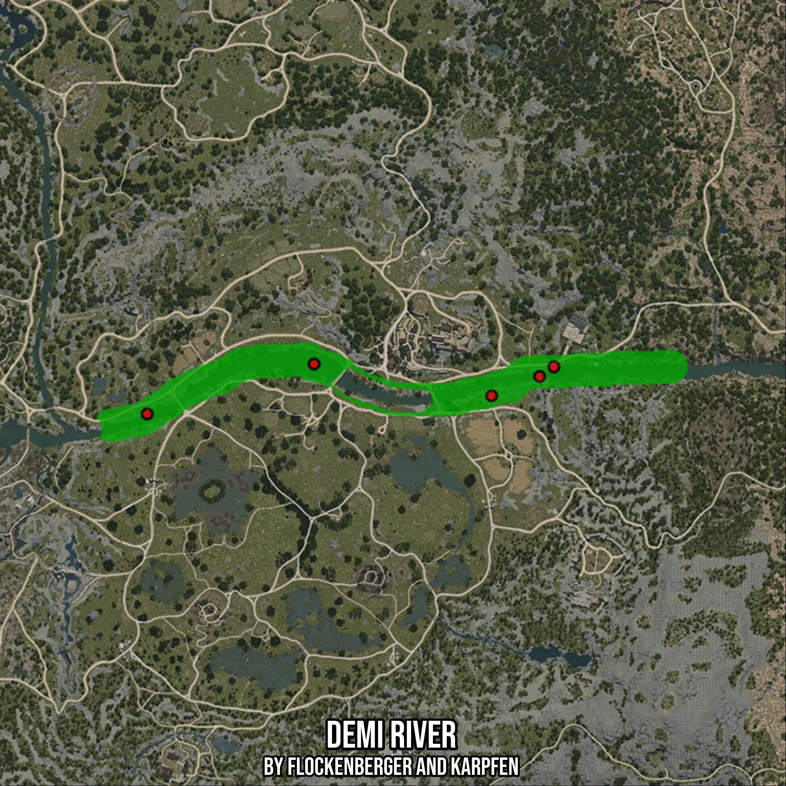

# Demi River
Created by **flockenberger**

- **Red Points**: Exact in-game waypoints.
- **Colored Areas**: Entire area where the fishing table is consistent.
## ⚠️ Info about your float:
To verify your fishing position without modifying your files, you can do so [here](https://flockenberger.github.io/bdo-fish-position/).
- Or watch the guide [here](https://youtu.be/t-VXcRoNojk)

## Waypoints
Below you'll find the Copy-Paste ready XML file for this Fishing-Zone.

```xml
	<!--
		Waypoints for: Demi River
		Auto-Generated by: flockenberger
		Preview at: https://github.com/Flockenberger/bdo-fish-waypoints/tree/main/Bookmark/Demi%20River
	-->
	<WorldmapBookMark>
		<BookMark BookMarkName="1: Demi River" PosX="70475.33555030823" PosY="0.0" PosZ="-52705.923438072205" />
		<BookMark BookMarkName="2: Demi River" PosX="14757.687401771545" PosY="0.0" PosZ="-42767.099714279175" />
		<BookMark BookMarkName="3: Demi River" PosX="-37647.01950550079" PosY="0.0" PosZ="-58428.27649116516" />
		<BookMark BookMarkName="4: Demi River" PosX="85534.15937423706" PosY="0.0" PosZ="-46682.39390850067" />
		<BookMark BookMarkName="5: Demi River" PosX="90051.80652141571" PosY="0.0" PosZ="-43670.629143714905" />
	</WorldmapBookMark>
```

## Usage Guide
[](https://youtu.be/W-bWmKdv8K8)

## Previews
     

 