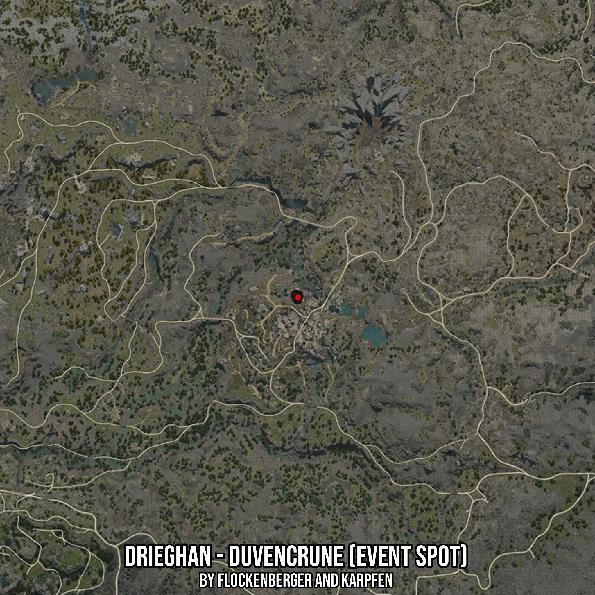

# Drieghan - Duvencrune (Event Spot)
Created by **flockenberger**

- **Red Points**: Exact in-game waypoints.
- **Colored Areas**: Entire area where the fishing table is consistent.
## ⚠️ Info about your float:
To verify your fishing position without modifying your files, you can do so [here](https://flockenberger.github.io/bdo-fish-position/).
- Or watch the guide [here](https://youtu.be/t-VXcRoNojk)

## Waypoints
Below you'll find the Copy-Paste ready XML file for this Fishing-Zone.

```xml
	<!--
		Waypoints for: Drieghan - Duvencrune (Event Spot)
		Auto-Generated by: flockenberger
		Preview at: https://github.com/Flockenberger/bdo-fish-waypoints/tree/main/Bookmark/Drieghan%20-%20Duvencrune%20(Event%20Spot)
	-->
	<WorldmapBookMark>
		<BookMark BookMarkName="1: Drieghan - Duvencrune (Event Spot)" PosX="-52404.66685295105" PosY="0.0" PosZ="-393938.87128829956" />
		<BookMark BookMarkName="2: Drieghan - Duvencrune (Event Spot)" PosX="-52103.49037647247" PosY="0.0" PosZ="-394842.4007177353" />
		<BookMark BookMarkName="3: Drieghan - Duvencrune (Event Spot)" PosX="-51802.3138999939" PosY="0.0" PosZ="-396047.1066236496" />
		<BookMark BookMarkName="4: Drieghan - Duvencrune (Event Spot)" PosX="-51501.13742351532" PosY="0.0" PosZ="-394240.04776477814" />
		<BookMark BookMarkName="5: Drieghan - Duvencrune (Event Spot)" PosX="-51501.13742351532" PosY="0.0" PosZ="-395143.57719421387" />
	</WorldmapBookMark>
```

## Usage Guide
[](https://youtu.be/W-bWmKdv8K8)

## Previews
     

 