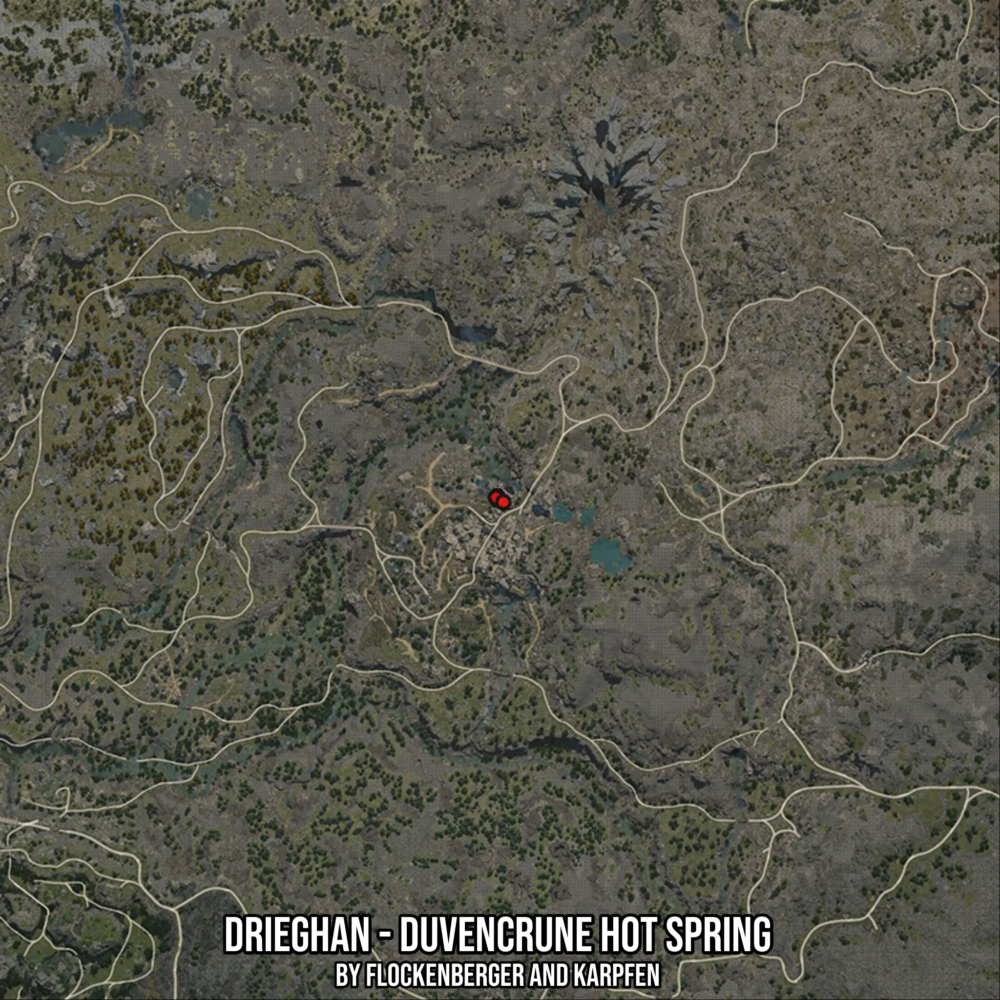

# Drieghan - Duvencrune Hot Spring
Created by **flockenberger**

- **Red Points**: Exact in-game waypoints.
- **Colored Areas**: Entire area where the fishing table is consistent.
## ⚠️ Info about your float:
To verify your fishing position without modifying your files, you can do so [here](https://flockenberger.github.io/bdo-fish-position/).
- Or watch the guide [here](https://youtu.be/t-VXcRoNojk)

## Waypoints
Below you'll find the Copy-Paste ready XML file for this Fishing-Zone.

```xml
	<!--
		Waypoints for: Drieghan - Duvencrune Hot Spring
		Auto-Generated by: flockenberger
		Preview at: https://github.com/Flockenberger/bdo-fish-waypoints/tree/main/Bookmark/Drieghan%20-%20Duvencrune%20Hot%20Spring
	-->
	<WorldmapBookMark>
		<BookMark BookMarkName="1: Drieghan - Duvencrune Hot Spring" PosX="-47284.66675281525" PosY="0.0" PosZ="-396348.2831001282" />
		<BookMark BookMarkName="2: Drieghan - Duvencrune Hot Spring" PosX="-46983.49027633667" PosY="0.0" PosZ="-397251.8125295639" />
		<BookMark BookMarkName="3: Drieghan - Duvencrune Hot Spring" PosX="-47284.66675281525" PosY="0.0" PosZ="-397251.8125295639" />
		<BookMark BookMarkName="4: Drieghan - Duvencrune Hot Spring" PosX="-47585.84322929382" PosY="0.0" PosZ="-396649.45957660675" />
		<BookMark BookMarkName="5: Drieghan - Duvencrune Hot Spring" PosX="-45778.78437042236" PosY="0.0" PosZ="-397854.16548252106" />
	</WorldmapBookMark>
```

## Usage Guide
[](https://youtu.be/W-bWmKdv8K8)

## Previews
     

 