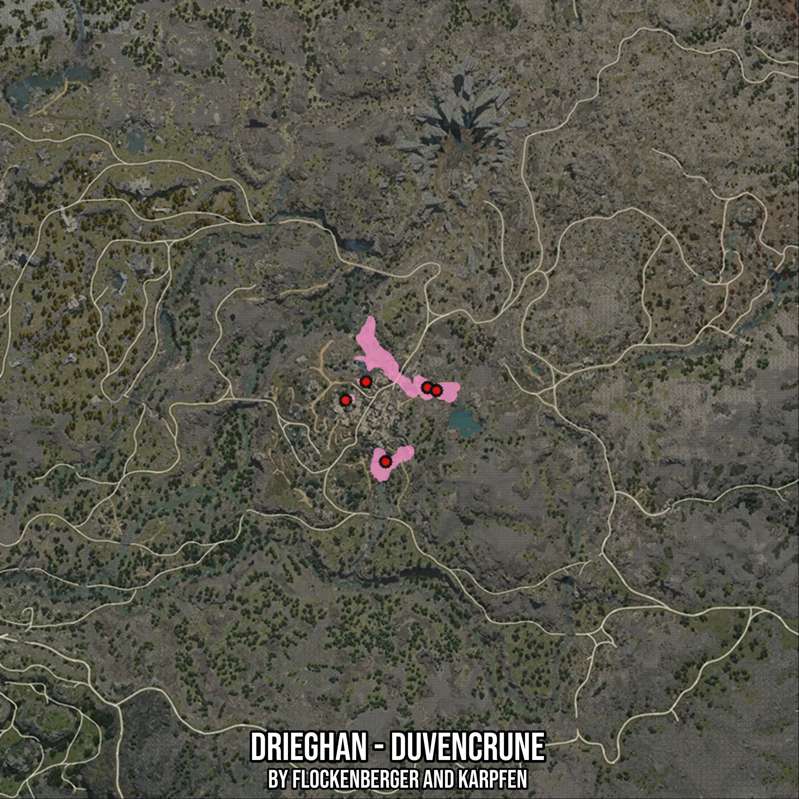

# Drieghan - Duvencrune
Created by **flockenberger**

- **Red Points**: Exact in-game waypoints.
- **Colored Areas**: Entire area where the fishing table is consistent.
## ⚠️ Info about your float:
To verify your fishing position without modifying your files, you can do so [here](https://flockenberger.github.io/bdo-fish-position/).
- Or watch the guide [here](https://youtu.be/t-VXcRoNojk)

## Waypoints
Below you'll find the Copy-Paste ready XML file for this Fishing-Zone.

```xml
	<!--
		Waypoints for: Drieghan - Duvencrune
		Auto-Generated by: flockenberger
		Preview at: https://github.com/Flockenberger/bdo-fish-waypoints/tree/main/Bookmark/Drieghan%20-%20Duvencrune
	-->
	<WorldmapBookMark>
		<BookMark BookMarkName="1: Drieghan - Duvencrune" PosX="-31021.137022972107" PosY="0.0" PosZ="-400263.57729434967" />
		<BookMark BookMarkName="2: Drieghan - Duvencrune" PosX="-43971.7255115509" PosY="0.0" PosZ="-423152.9895067215" />
		<BookMark BookMarkName="3: Drieghan - Duvencrune" PosX="-49995.25504112244" PosY="0.0" PosZ="-398456.5184354782" />
		<BookMark BookMarkName="4: Drieghan - Duvencrune" PosX="-56319.96104717255" PosY="0.0" PosZ="-404178.87148857117" />
		<BookMark BookMarkName="5: Drieghan - Duvencrune" PosX="-28310.548734664917" PosY="0.0" PosZ="-401167.1067237854" />
	</WorldmapBookMark>
```

## Usage Guide
[](https://youtu.be/W-bWmKdv8K8)

## Previews
     

 