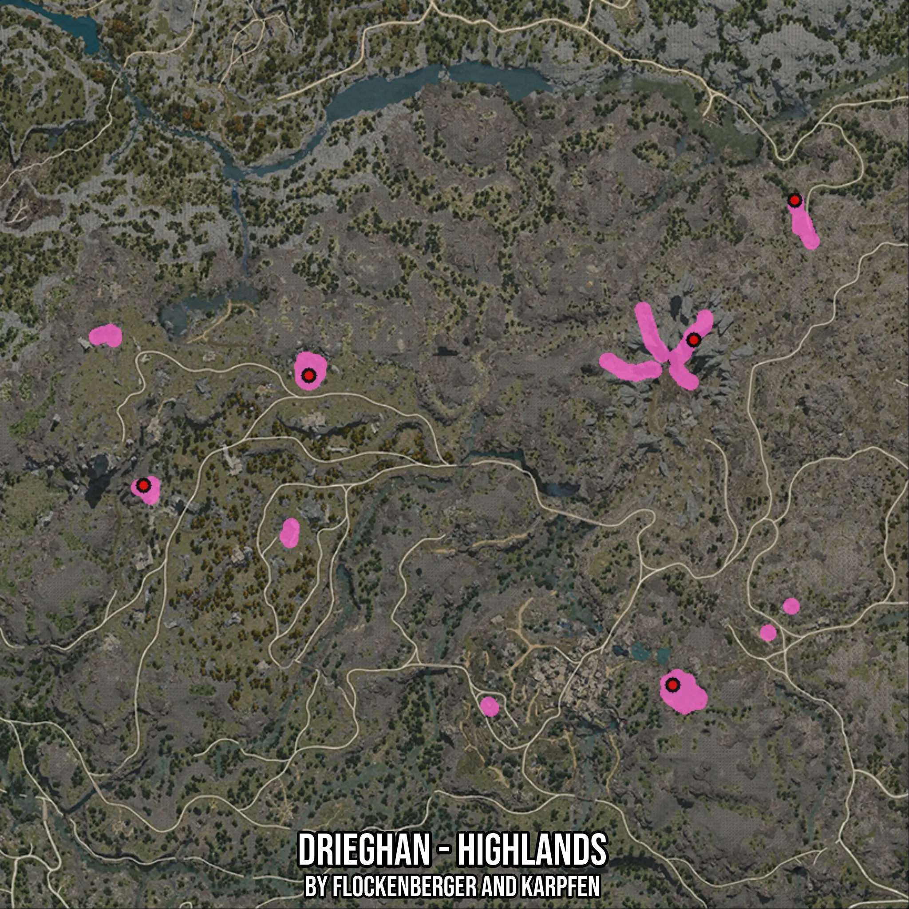

# Drieghan - Highlands
Created by **flockenberger**

- **Red Points**: Exact in-game waypoints.
- **Colored Areas**: Entire area where the fishing table is consistent.
## ⚠️ Info about your float:
To verify your fishing position without modifying your files, you can do so [here](https://flockenberger.github.io/bdo-fish-position/).
- Or watch the guide [here](https://youtu.be/t-VXcRoNojk)

## Waypoints
Below you'll find the Copy-Paste ready XML file for this Fishing-Zone.

```xml
	<!--
		Waypoints for: Drieghan - Highlands
		Auto-Generated by: flockenberger
		Preview at: https://github.com/Flockenberger/bdo-fish-waypoints/tree/main/Bookmark/Drieghan%20-%20Highlands
	-->
	<WorldmapBookMark>
		<BookMark BookMarkName="1: Drieghan - Highlands" PosX="-16564.666152000427" PosY="0.0" PosZ="-315632.9874038696" />
		<BookMark BookMarkName="2: Drieghan - Highlands" PosX="-22287.019205093384" PosY="0.0" PosZ="-409298.87158870697" />
		<BookMark BookMarkName="3: Drieghan - Highlands" PosX="-121072.90349006653" PosY="0.0" PosZ="-325270.6346511841" />
		<BookMark BookMarkName="4: Drieghan - Highlands" PosX="10842.393207550049" PosY="0.0" PosZ="-277684.75136756897" />
		<BookMark BookMarkName="5: Drieghan - Highlands" PosX="-165948.19848537445" PosY="0.0" PosZ="-355087.1058225632" />
	</WorldmapBookMark>
```

## Usage Guide
[](https://youtu.be/W-bWmKdv8K8)

## Previews
     

 