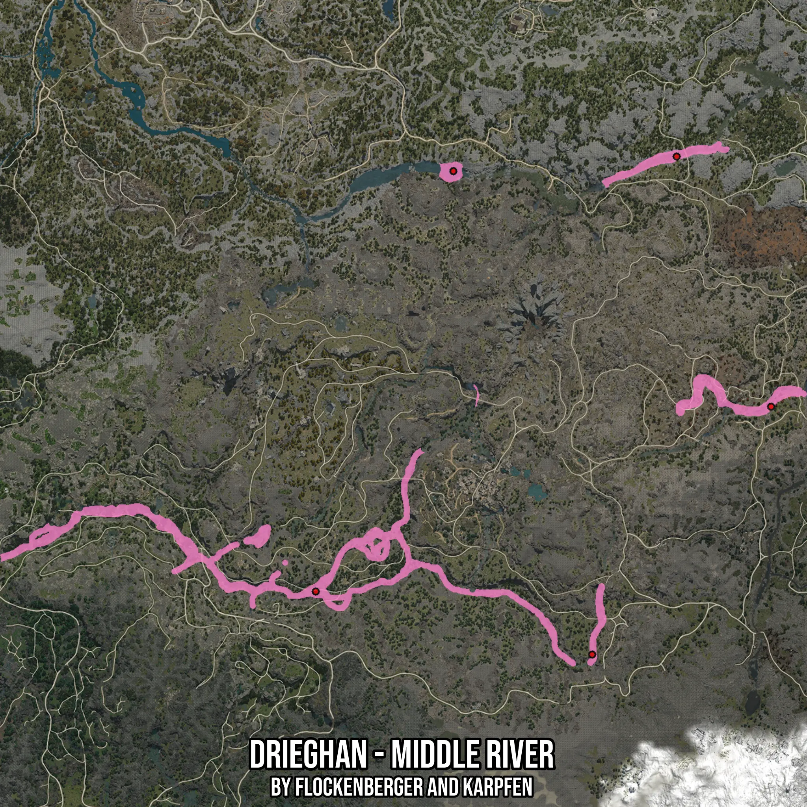

# Drieghan - Middle River
Created by **flockenberger**

- **Red Points**: Exact in-game waypoints.
- **Colored Areas**: Entire area where the fishing table is consistent.
## ⚠️ Info about your float:
To verify your fishing position without modifying your files, you can do so [here](https://flockenberger.github.io/bdo-fish-position/).
- Or watch the guide [here](https://youtu.be/t-VXcRoNojk)

## Waypoints
Below you'll find the Copy-Paste ready XML file for this Fishing-Zone.

```xml
	<!--
		Waypoints for: Drieghan - Middle River
		Auto-Generated by: flockenberger
		Preview at: https://github.com/Flockenberger/bdo-fish-waypoints/tree/main/Bookmark/Drieghan%20-%20Middle%20River
	-->
	<WorldmapBookMark>
		<BookMark BookMarkName="1: Drieghan - Middle River" PosX="-134023.49197864532" PosY="0.0" PosZ="-462305.93144893646" />
		<BookMark BookMarkName="2: Drieghan - Middle River" PosX="101195.33615112305" PosY="0.0" PosZ="-366832.98840522766" />
		<BookMark BookMarkName="3: Drieghan - Middle River" PosX="52404.74696159363" PosY="0.0" PosZ="-237628.27999591827" />
		<BookMark BookMarkName="4: Drieghan - Middle River" PosX="8734.157872200012" PosY="0.0" PosZ="-494832.99090862274" />
		<BookMark BookMarkName="5: Drieghan - Middle River" PosX="-62945.84352970123" PosY="0.0" PosZ="-245157.6919078827" />
	</WorldmapBookMark>
```

## Usage Guide
[](https://youtu.be/W-bWmKdv8K8)

## Previews
     

 