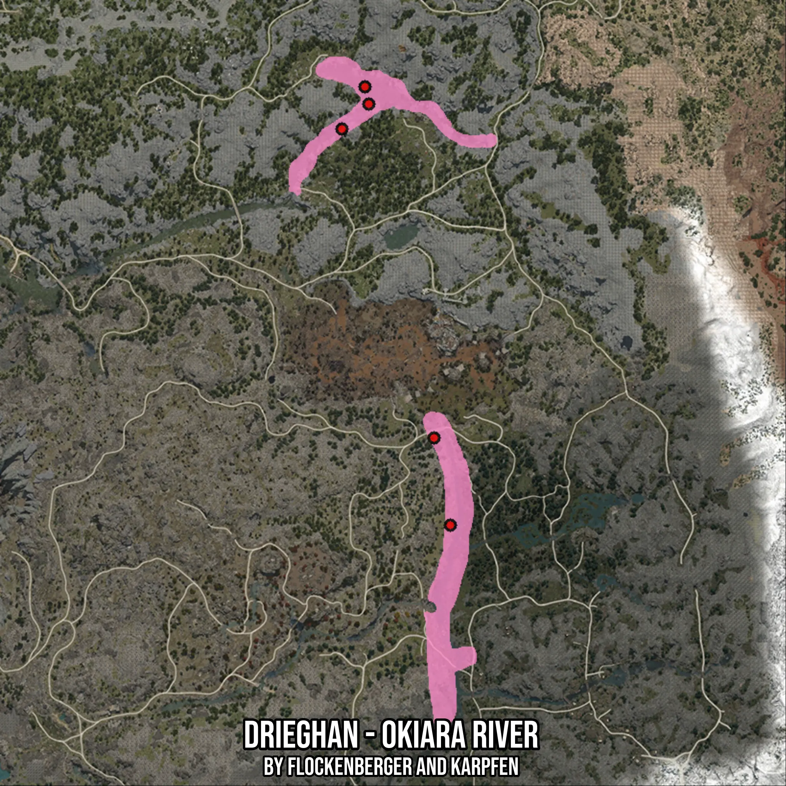

# Drieghan - Okiara River
Created by **flockenberger**

- **Red Points**: Exact in-game waypoints.
- **Colored Areas**: Entire area where the fishing table is consistent.
## ⚠️ Info about your float:
To verify your fishing position without modifying your files, you can do so [here](https://flockenberger.github.io/bdo-fish-position/).
- Or watch the guide [here](https://youtu.be/t-VXcRoNojk)

## Waypoints
Below you'll find the Copy-Paste ready XML file for this Fishing-Zone.

```xml
	<!--
		Waypoints for: Drieghan - Okiara River
		Auto-Generated by: flockenberger
		Preview at: https://github.com/Flockenberger/bdo-fish-waypoints/tree/main/Bookmark/Drieghan%20-%20Okiara%20River
	-->
	<WorldmapBookMark>
		<BookMark BookMarkName="1: Drieghan - Okiara River" PosX="124084.74836349487" PosY="0.0" PosZ="-334305.9289455414" />
		<BookMark BookMarkName="2: Drieghan - Okiara River" PosX="98484.74786281586" PosY="0.0" PosZ="-202089.45577144623" />
		<BookMark BookMarkName="3: Drieghan - Okiara River" PosX="118964.74826335907" PosY="0.0" PosZ="-306898.8695859909" />
		<BookMark BookMarkName="4: Drieghan - Okiara River" PosX="97280.04195690155" PosY="0.0" PosZ="-196668.27919483185" />
		<BookMark BookMarkName="5: Drieghan - Okiara River" PosX="90051.80652141571" PosY="0.0" PosZ="-209920.04415988922" />
	</WorldmapBookMark>
```

## Usage Guide
[](https://youtu.be/W-bWmKdv8K8)

## Previews
     

 