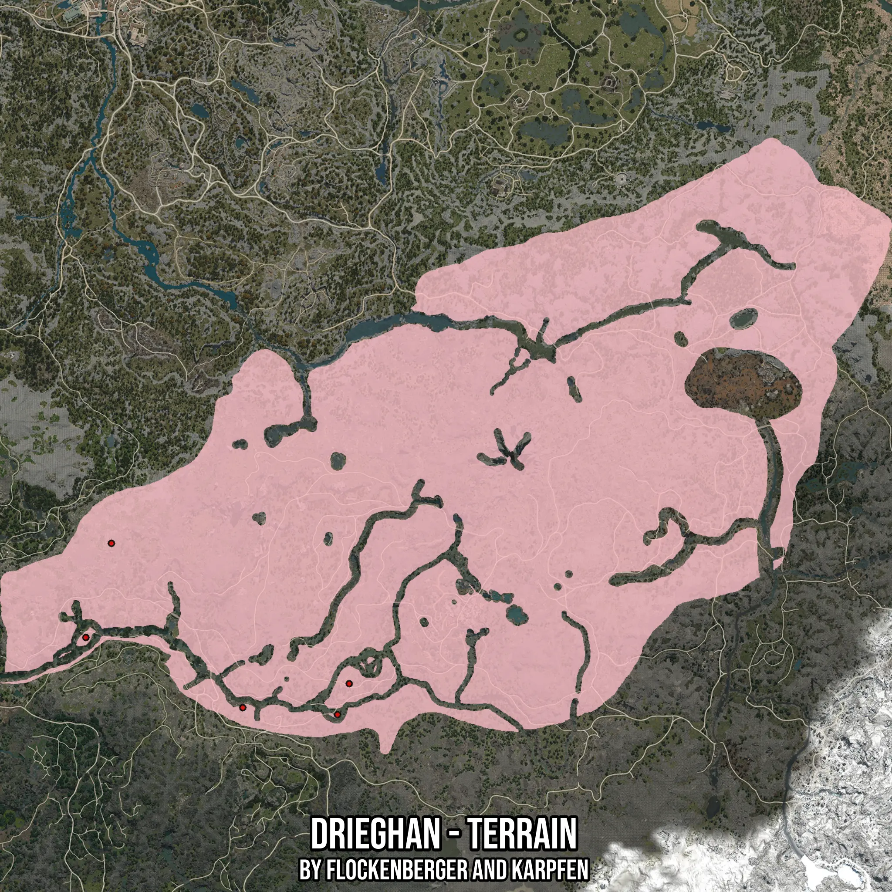

# Drieghan - Terrain
Created by **flockenberger**

- **Red Points**: Exact in-game waypoints.
- **Colored Areas**: Entire area where the fishing table is consistent.
## ⚠️ Info about your float:
To verify your fishing position without modifying your files, you can do so [here](https://flockenberger.github.io/bdo-fish-position/).
- Or watch the guide [here](https://youtu.be/t-VXcRoNojk)

## Waypoints
Below you'll find the Copy-Paste ready XML file for this Fishing-Zone.

```xml
	<!--
		Waypoints for: Drieghan - Terrain
		Auto-Generated by: flockenberger
		Preview at: https://github.com/Flockenberger/bdo-fish-waypoints/tree/main/Bookmark/Drieghan%20-%20Terrain
	-->
	<WorldmapBookMark>
		<BookMark BookMarkName="1: Drieghan - Terrain" PosX="-249072.9059934616" PosY="0.0" PosZ="-370447.1061229706" />
		<BookMark BookMarkName="2: Drieghan - Terrain" PosX="-174682.31630325317" PosY="0.0" PosZ="-463510.63735485077" />
		<BookMark BookMarkName="3: Drieghan - Terrain" PosX="-114447.02100753784" PosY="0.0" PosZ="-449957.6959133148" />
		<BookMark BookMarkName="4: Drieghan - Terrain" PosX="-263529.3768644333" PosY="0.0" PosZ="-423755.34245967865" />
		<BookMark BookMarkName="5: Drieghan - Terrain" PosX="-121072.90349006653" PosY="0.0" PosZ="-467425.93154907227" />
	</WorldmapBookMark>
```

## Usage Guide
[](https://youtu.be/W-bWmKdv8K8)

## Previews
     

 