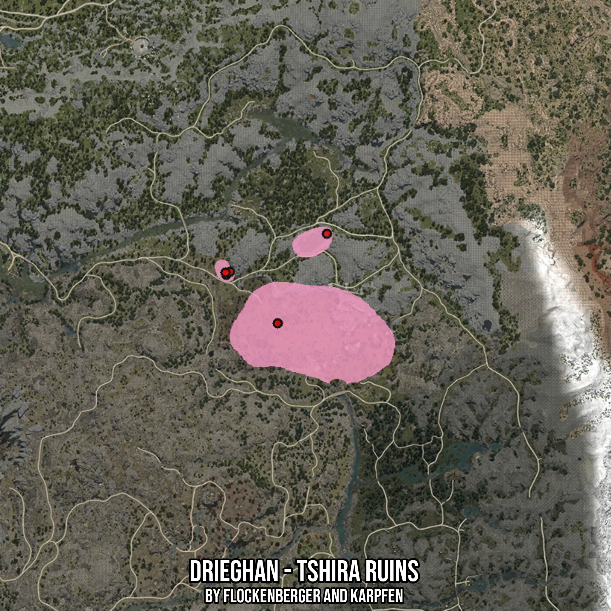

# Drieghan - Tshira Ruins
Created by **flockenberger**

- **Red Points**: Exact in-game waypoints.
- **Colored Areas**: Entire area where the fishing table is consistent.
## ⚠️ Info about your float:
To verify your fishing position without modifying your files, you can do so [here](https://flockenberger.github.io/bdo-fish-position/).
- Or watch the guide [here](https://youtu.be/t-VXcRoNojk)

## Waypoints
Below you'll find the Copy-Paste ready XML file for this Fishing-Zone.

```xml
	<!--
		Waypoints for: Drieghan - Tshira Ruins
		Auto-Generated by: flockenberger
		Preview at: https://github.com/Flockenberger/bdo-fish-waypoints/tree/main/Bookmark/Drieghan%20-%20Tshira%20Ruins
	-->
	<WorldmapBookMark>
		<BookMark BookMarkName="1: Drieghan - Tshira Ruins" PosX="94870.63014507294" PosY="0.0" PosZ="-276178.8689851761" />
		<BookMark BookMarkName="2: Drieghan - Tshira Ruins" PosX="114748.277592659" PosY="0.0" PosZ="-240037.6918077469" />
		<BookMark BookMarkName="3: Drieghan - Tshira Ruins" PosX="74089.45326805115" PosY="0.0" PosZ="-256602.3980140686" />
		<BookMark BookMarkName="4: Drieghan - Tshira Ruins" PosX="75595.33565044403" PosY="0.0" PosZ="-255397.6921081543" />
		<BookMark BookMarkName="5: Drieghan - Tshira Ruins" PosX="73788.27679157257" PosY="0.0" PosZ="-255698.86858463287" />
	</WorldmapBookMark>
```

## Usage Guide
[](https://youtu.be/W-bWmKdv8K8)

## Previews
     

 