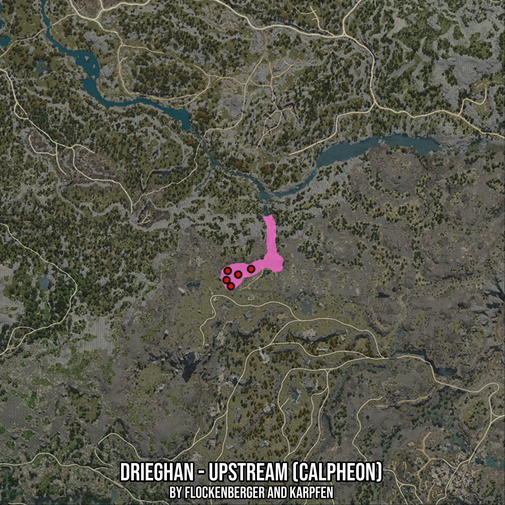

# Drieghan - Upstream (Calpheon)
Created by **flockenberger**

- **Red Points**: Exact in-game waypoints.
- **Colored Areas**: Entire area where the fishing table is consistent.
## ⚠️ Info about your float:
To verify your fishing position without modifying your files, you can do so [here](https://flockenberger.github.io/bdo-fish-position/).
- Or watch the guide [here](https://youtu.be/t-VXcRoNojk)

## Waypoints
Below you'll find the Copy-Paste ready XML file for this Fishing-Zone.

```xml
	<!--
		Waypoints for: Drieghan - Upstream (Calpheon)
		Auto-Generated by: flockenberger
		Preview at: https://github.com/Flockenberger/bdo-fish-waypoints/tree/main/Bookmark/Drieghan%20-%20Upstream%20(Calpheon)
	-->
	<WorldmapBookMark>
		<BookMark BookMarkName="1: Drieghan - Upstream (Calpheon)" PosX="-154503.49237918854" PosY="0.0" PosZ="-308705.92844486237" />
		<BookMark BookMarkName="2: Drieghan - Upstream (Calpheon)" PosX="-159623.49247932434" PosY="0.0" PosZ="-306898.8695859909" />
		<BookMark BookMarkName="3: Drieghan - Upstream (Calpheon)" PosX="-148178.78637313843" PosY="0.0" PosZ="-305995.3401565552" />
		<BookMark BookMarkName="4: Drieghan - Upstream (Calpheon)" PosX="-160225.8454322815" PosY="0.0" PosZ="-311416.51673316956" />
		<BookMark BookMarkName="5: Drieghan - Upstream (Calpheon)" PosX="-158117.61009693146" PosY="0.0" PosZ="-314428.2814979553" />
	</WorldmapBookMark>
```

## Usage Guide
[](https://youtu.be/W-bWmKdv8K8)

## Previews
     

 