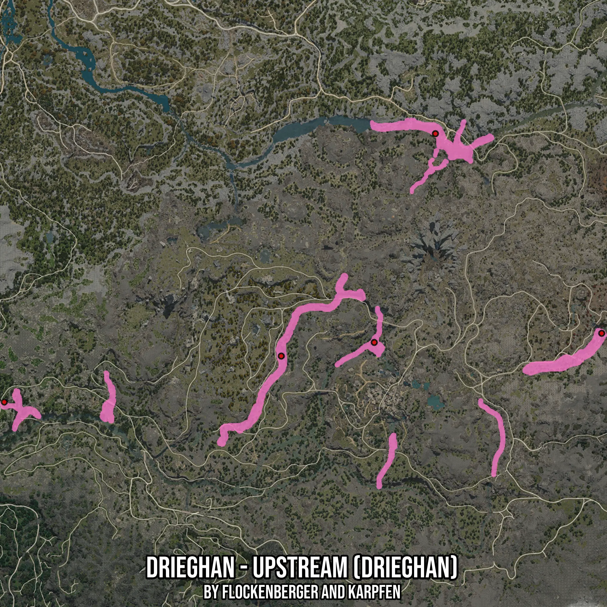

# Drieghan - Upstream (Drieghan)
Created by **flockenberger**

- **Red Points**: Exact in-game waypoints.
- **Colored Areas**: Entire area where the fishing table is consistent.
## ⚠️ Info about your float:
To verify your fishing position without modifying your files, you can do so [here](https://flockenberger.github.io/bdo-fish-position/).
- Or watch the guide [here](https://youtu.be/t-VXcRoNojk)

## Waypoints
Below you'll find the Copy-Paste ready XML file for this Fishing-Zone.

```xml
	<!--
		Waypoints for: Drieghan - Upstream (Drieghan)
		Auto-Generated by: flockenberger
		Preview at: https://github.com/Flockenberger/bdo-fish-waypoints/tree/main/Bookmark/Drieghan%20-%20Upstream%20(Drieghan)
	-->
	<WorldmapBookMark>
		<BookMark BookMarkName="1: Drieghan - Upstream (Drieghan)" PosX="-111435.25624275208" PosY="0.0" PosZ="-383397.6946115494" />
		<BookMark BookMarkName="2: Drieghan - Upstream (Drieghan)" PosX="-19576.430916786194" PosY="0.0" PosZ="-250880.04496097565" />
		<BookMark BookMarkName="3: Drieghan - Upstream (Drieghan)" PosX="79510.62984466553" PosY="0.0" PosZ="-369844.7531700134" />
		<BookMark BookMarkName="4: Drieghan - Upstream (Drieghan)" PosX="-56018.78457069397" PosY="0.0" PosZ="-375265.9297466278" />
		<BookMark BookMarkName="5: Drieghan - Upstream (Drieghan)" PosX="-276479.9653530121" PosY="0.0" PosZ="-410804.75397109985" />
	</WorldmapBookMark>
```

## Usage Guide
[](https://youtu.be/W-bWmKdv8K8)

## Previews
     

 