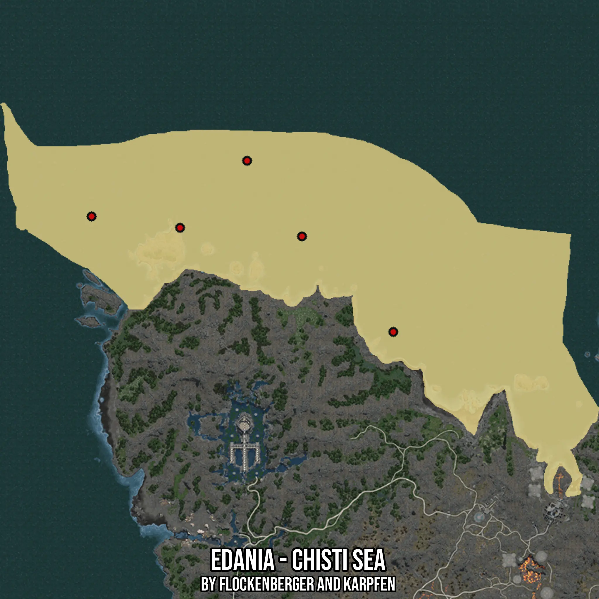

# Edania - Chisti Sea
Created by **flockenberger**

- **Red Points**: Exact in-game waypoints.
- **Colored Areas**: Entire area where the fishing table is consistent.
## ⚠️ Info about your float:
To verify your fishing position without modifying your files, you can do so [here](https://flockenberger.github.io/bdo-fish-position/).
- Or watch the guide [here](https://youtu.be/t-VXcRoNojk)

## Waypoints
Below you'll find the Copy-Paste ready XML file for this Fishing-Zone.

```xml
	<!--
		Waypoints for: Edania - Chisti Sea
		Auto-Generated by: flockenberger
		Preview at: https://github.com/Flockenberger/bdo-fish-waypoints/tree/main/Bookmark/Edania%20-%20Chisti%20Sea
	-->
	<WorldmapBookMark>
		<BookMark BookMarkName="1: Edania - Chisti Sea" PosX="501157.69691467285" PosY="-8175.0" PosZ="804743.5050964355" />
		<BookMark BookMarkName="2: Edania - Chisti Sea" PosX="552658.8743925095" PosY="-8175.0" PosZ="801129.3873786926" />
		<BookMark BookMarkName="3: Edania - Chisti Sea" PosX="529468.285703659" PosY="-8175.0" PosZ="833054.0938854218" />
		<BookMark BookMarkName="4: Edania - Chisti Sea" PosX="591209.4633817673" PosY="-8175.0" PosZ="760771.7395305634" />
		<BookMark BookMarkName="5: Edania - Chisti Sea" PosX="463811.81383132935" PosY="-8175.0" PosZ="809562.3287200928" />
	</WorldmapBookMark>
```

## Usage Guide
[](https://youtu.be/W-bWmKdv8K8)

## Previews
     

 