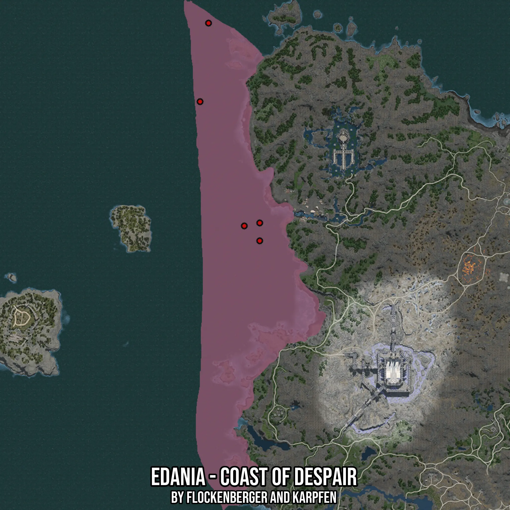

# Edania - Coast of Despair
Created by **flockenberger**

- **Red Points**: Exact in-game waypoints.
- **Colored Areas**: Entire area where the fishing table is consistent.
## ⚠️ Info about your float:
To verify your fishing position without modifying your files, you can do so [here](https://flockenberger.github.io/bdo-fish-position/).
- Or watch the guide [here](https://youtu.be/t-VXcRoNojk)

## Waypoints
Below you'll find the Copy-Paste ready XML file for this Fishing-Zone.

```xml
	<!--
		Waypoints for: Edania - Coast of Despair
		Auto-Generated by: flockenberger
		Preview at: https://github.com/Flockenberger/bdo-fish-waypoints/tree/main/Bookmark/Edania%20-%20Coast%20of%20Despair
	-->
	<WorldmapBookMark>
		<BookMark BookMarkName="1: Edania - Coast of Despair" PosX="477665.9317493439" PosY="-8175.0" PosZ="669515.2671575546" />
		<BookMark BookMarkName="2: Edania - Coast of Despair" PosX="446644.7546720505" PosY="-8175.0" PosZ="790588.2107019424" />
		<BookMark BookMarkName="3: Edania - Coast of Despair" PosX="468329.460978508" PosY="-8175.0" PosZ="667708.2082986832" />
		<BookMark BookMarkName="4: Edania - Coast of Despair" PosX="441524.7545719147" PosY="-8175.0" PosZ="743002.3274183273" />
		<BookMark BookMarkName="5: Edania - Coast of Despair" PosX="477665.9317493439" PosY="-8175.0" PosZ="658672.9140043259" />
	</WorldmapBookMark>
```

## Usage Guide
[](https://youtu.be/W-bWmKdv8K8)

## Previews
     

 