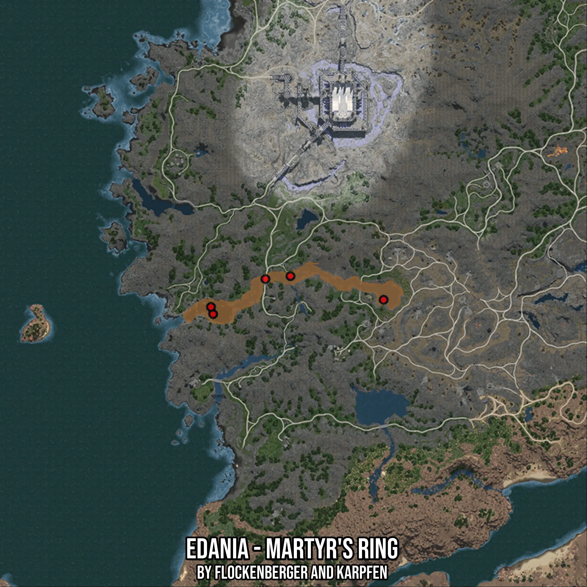

# Edania - Martyr's Ring
Created by **flockenberger**

- **Red Points**: Exact in-game waypoints.
- **Colored Areas**: Entire area where the fishing table is consistent.
## ⚠️ Info about your float:
To verify your fishing position without modifying your files, you can do so [here](https://flockenberger.github.io/bdo-fish-position/).
- Or watch the guide [here](https://youtu.be/t-VXcRoNojk)

## Waypoints
Below you'll find the Copy-Paste ready XML file for this Fishing-Zone.

```xml
	<!--
		Waypoints for: Edania - Martyr's Ring
		Auto-Generated by: flockenberger
		Preview at: https://github.com/Flockenberger/bdo-fish-waypoints/tree/main/Bookmark/Edania%20-%20Martyr's%20Ring
	-->
	<WorldmapBookMark>
		<BookMark BookMarkName="1: Edania - Martyr's Ring" PosX="504169.4616794586" PosY="0.0" PosZ="490014.08717632294" />
		<BookMark BookMarkName="2: Edania - Martyr's Ring" PosX="575849.4630813599" PosY="0.0" PosZ="496037.61670589447" />
		<BookMark BookMarkName="3: Edania - Martyr's Ring" PosX="526155.3444623947" PosY="0.0" PosZ="504771.7345237732" />
		<BookMark BookMarkName="4: Edania - Martyr's Ring" PosX="503265.9322500229" PosY="0.0" PosZ="493025.8519411087" />
		<BookMark BookMarkName="5: Edania - Martyr's Ring" PosX="536696.5211391449" PosY="0.0" PosZ="505976.4404296875" />
	</WorldmapBookMark>
```

## Usage Guide
[](https://youtu.be/W-bWmKdv8K8)

## Previews
     

 