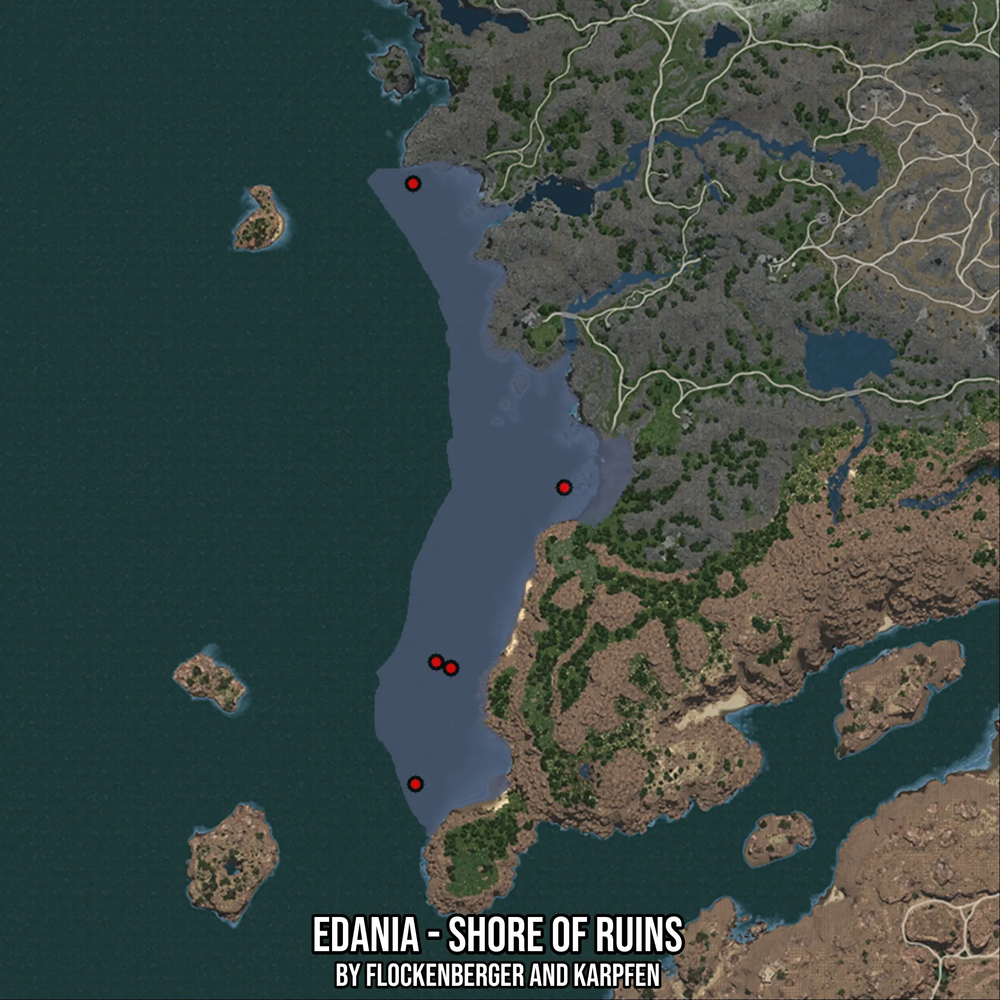

# Edania - Shore of Ruins
Created by **flockenberger**

- **Red Points**: Exact in-game waypoints.
- **Colored Areas**: Entire area where the fishing table is consistent.
## ⚠️ Info about your float:
To verify your fishing position without modifying your files, you can do so [here](https://flockenberger.github.io/bdo-fish-position/).
- Or watch the guide [here](https://youtu.be/t-VXcRoNojk)

## Waypoints
Below you'll find the Copy-Paste ready XML file for this Fishing-Zone.

```xml
	<!--
		Waypoints for: Edania - Shore of Ruins
		Auto-Generated by: flockenberger
		Preview at: https://github.com/Flockenberger/bdo-fish-waypoints/tree/main/Bookmark/Edania%20-%20Shore%20of%20Ruins
	-->
	<WorldmapBookMark>
		<BookMark BookMarkName="1: Edania - Shore of Ruins" PosX="504771.8146324158" PosY="-8175.0" PosZ="419538.791680336" />
		<BookMark BookMarkName="2: Edania - Shore of Ruins" PosX="476762.40231990814" PosY="-8175.0" PosZ="374964.67316150665" />
		<BookMark BookMarkName="3: Edania - Shore of Ruins" PosX="468028.2845020294" PosY="-8175.0" PosZ="346352.90789604187" />
		<BookMark BookMarkName="4: Edania - Shore of Ruins" PosX="467425.93154907227" PosY="-8175.0" PosZ="494531.7343235016" />
		<BookMark BookMarkName="5: Edania - Shore of Ruins" PosX="473148.2846021652" PosY="-8175.0" PosZ="376470.55554389954" />
	</WorldmapBookMark>
```

## Usage Guide
[](https://youtu.be/W-bWmKdv8K8)

## Previews
     

 