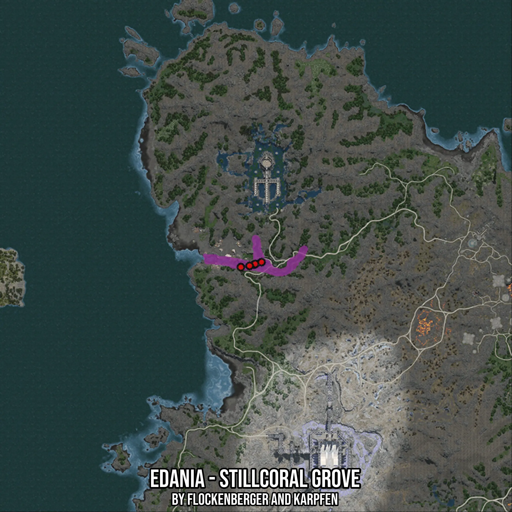

# Edania - Stillcoral Grove
Created by **flockenberger**

- **Red Points**: Exact in-game waypoints.
- **Colored Areas**: Entire area where the fishing table is consistent.
## ⚠️ Info about your float:
To verify your fishing position without modifying your files, you can do so [here](https://flockenberger.github.io/bdo-fish-position/).
- Or watch the guide [here](https://youtu.be/t-VXcRoNojk)

## Waypoints
Below you'll find the Copy-Paste ready XML file for this Fishing-Zone.

```xml
	<!--
		Waypoints for: Edania - Stillcoral Grove
		Auto-Generated by: flockenberger
		Preview at: https://github.com/Flockenberger/bdo-fish-waypoints/tree/main/Bookmark/Edania%20-%20Stillcoral%20Grove
	-->
	<WorldmapBookMark>
		<BookMark BookMarkName="1: Edania - Stillcoral Grove" PosX="522240.0502681732" PosY="0.0" PosZ="672225.8554458618" />
		<BookMark BookMarkName="2: Edania - Stillcoral Grove" PosX="522842.4032211304" PosY="0.0" PosZ="672527.0319223404" />
		<BookMark BookMarkName="3: Edania - Stillcoral Grove" PosX="515915.3442621231" PosY="0.0" PosZ="671021.1495399475" />
		<BookMark BookMarkName="4: Edania - Stillcoral Grove" PosX="520131.8149328232" PosY="0.0" PosZ="671623.5024929047" />
		<BookMark BookMarkName="5: Edania - Stillcoral Grove" PosX="525854.1679859161" PosY="0.0" PosZ="673430.5613517761" />
	</WorldmapBookMark>
```

## Usage Guide
[](https://youtu.be/W-bWmKdv8K8)

## Previews
     

 