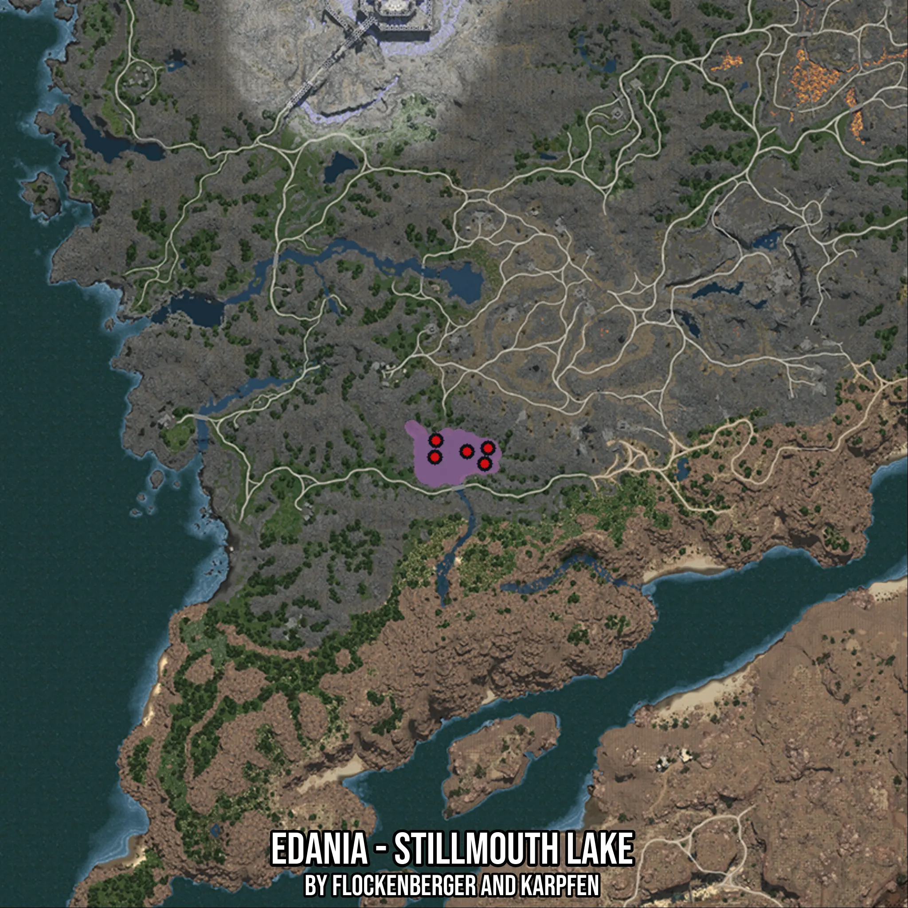

# Edania - Stillmouth Lake
Created by **flockenberger**

- **Red Points**: Exact in-game waypoints.
- **Colored Areas**: Entire area where the fishing table is consistent.
## ⚠️ Info about your float:
To verify your fishing position without modifying your files, you can do so [here](https://flockenberger.github.io/bdo-fish-position/).
- Or watch the guide [here](https://youtu.be/t-VXcRoNojk)

## Waypoints
Below you'll find the Copy-Paste ready XML file for this Fishing-Zone.

```xml
	<!--
		Waypoints for: Edania - Stillmouth Lake
		Auto-Generated by: flockenberger
		Preview at: https://github.com/Flockenberger/bdo-fish-waypoints/tree/main/Bookmark/Edania%20-%20Stillmouth%20Lake
	-->
	<WorldmapBookMark>
		<BookMark BookMarkName="1: Edania - Stillmouth Lake" PosX="569524.7570753098" PosY="0.0" PosZ="451162.32171058655" />
		<BookMark BookMarkName="2: Edania - Stillmouth Lake" PosX="578258.8748931885" PosY="0.0" PosZ="452668.20409297943" />
		<BookMark BookMarkName="3: Edania - Stillmouth Lake" PosX="583981.2279462814" PosY="0.0" PosZ="453571.73352241516" />
		<BookMark BookMarkName="4: Edania - Stillmouth Lake" PosX="569825.9335517883" PosY="0.0" PosZ="455679.9688577652" />
		<BookMark BookMarkName="5: Edania - Stillmouth Lake" PosX="583077.6985168457" PosY="0.0" PosZ="449355.2628517151" />
	</WorldmapBookMark>
```

## Usage Guide
[](https://youtu.be/W-bWmKdv8K8)

## Previews
     

 