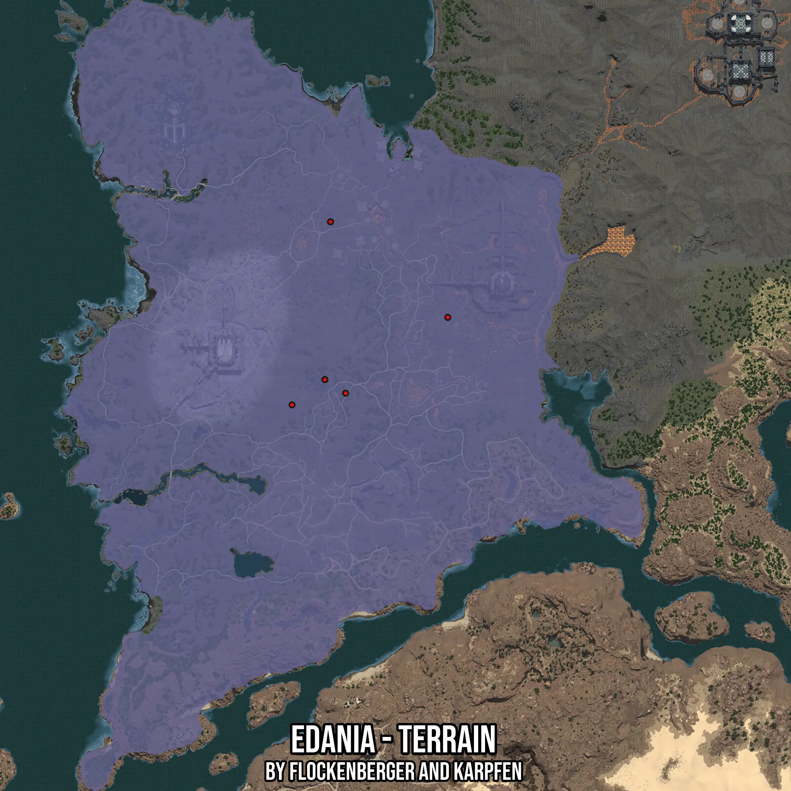

# Edania - Terrain
Created by **flockenberger**

- **Red Points**: Exact in-game waypoints.
- **Colored Areas**: Entire area where the fishing table is consistent.
## ⚠️ Info about your float:
To verify your fishing position without modifying your files, you can do so [here](https://flockenberger.github.io/bdo-fish-position/).
- Or watch the guide [here](https://youtu.be/t-VXcRoNojk)

## Waypoints
Below you'll find the Copy-Paste ready XML file for this Fishing-Zone.

```xml
	<!--
		Waypoints for: Edania - Terrain
		Auto-Generated by: flockenberger
		Preview at: https://github.com/Flockenberger/bdo-fish-waypoints/tree/main/Bookmark/Edania%20-%20Terrain
	-->
	<WorldmapBookMark>
		<BookMark BookMarkName="1: Edania - Terrain" PosX="630362.4053239822" PosY="0.0" PosZ="553261.147236824" />
		<BookMark BookMarkName="2: Edania - Terrain" PosX="621327.1110296249" PosY="0.0" PosZ="655359.9727630615" />
		<BookMark BookMarkName="3: Edania - Terrain" PosX="691200.0535726547" PosY="0.0" PosZ="598437.6187086105" />
		<BookMark BookMarkName="4: Edania - Terrain" PosX="618014.1697883606" PosY="0.0" PosZ="561392.9121017456" />
		<BookMark BookMarkName="5: Edania - Terrain" PosX="598437.6988172531" PosY="0.0" PosZ="546334.0882778168" />
	</WorldmapBookMark>
```

## Usage Guide
[](https://youtu.be/W-bWmKdv8K8)

## Previews
     

 