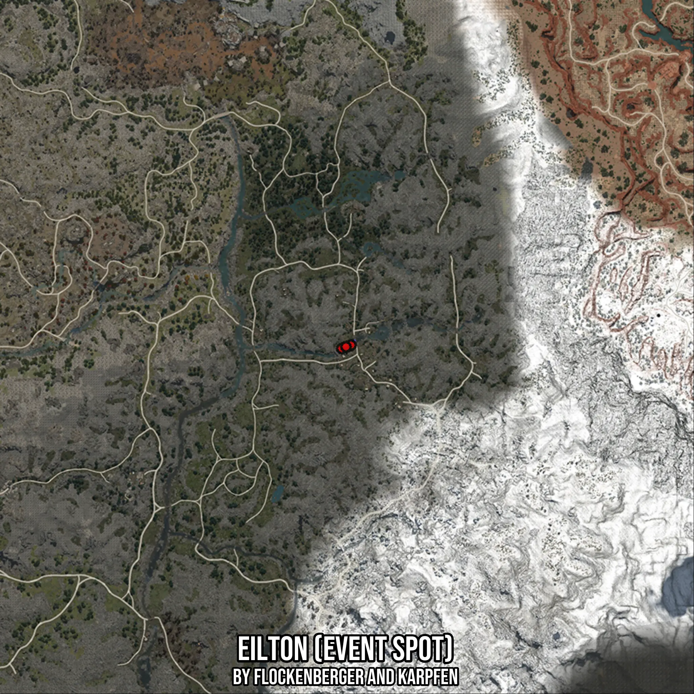

# Eilton (Event Spot)
Created by **flockenberger**

- **Red Points**: Exact in-game waypoints.
- **Colored Areas**: Entire area where the fishing table is consistent.
## ⚠️ Info about your float:
To verify your fishing position without modifying your files, you can do so [here](https://flockenberger.github.io/bdo-fish-position/).
- Or watch the guide [here](https://youtu.be/t-VXcRoNojk)

## Waypoints
Below you'll find the Copy-Paste ready XML file for this Fishing-Zone.

```xml
	<!--
		Waypoints for: Eilton (Event Spot)
		Auto-Generated by: flockenberger
		Preview at: https://github.com/Flockenberger/bdo-fish-waypoints/tree/main/Bookmark/Eilton%20(Event%20Spot)
	-->
	<WorldmapBookMark>
		<BookMark BookMarkName="1: Eilton (Event Spot)" PosX="162334.1608762741" PosY="0.0" PosZ="-387614.16528224945" />
		<BookMark BookMarkName="2: Eilton (Event Spot)" PosX="164141.21973514557" PosY="0.0" PosZ="-387011.8123292923" />
		<BookMark BookMarkName="3: Eilton (Event Spot)" PosX="165044.7491645813" PosY="0.0" PosZ="-386710.6358528137" />
		<BookMark BookMarkName="4: Eilton (Event Spot)" PosX="165647.10211753845" PosY="0.0" PosZ="-386409.45937633514" />
		<BookMark BookMarkName="5: Eilton (Event Spot)" PosX="163840.043258667" PosY="0.0" PosZ="-387011.8123292923" />
	</WorldmapBookMark>
```

## Usage Guide
[](https://youtu.be/W-bWmKdv8K8)

## Previews
     

 