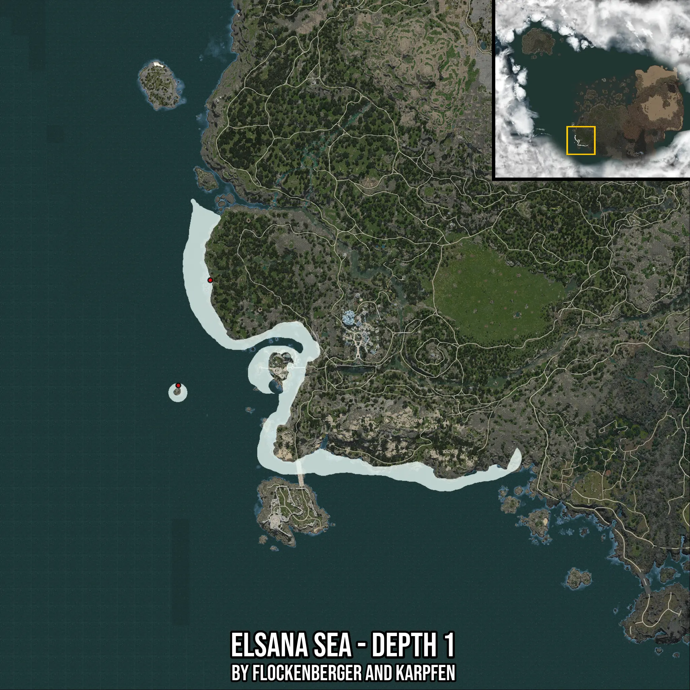

# Elsana Sea - Depth 1
Created by **flockenberger**

- **Red Points**: Exact in-game waypoints.
- **Colored Areas**: Entire area where the fishing table is consistent.
## ⚠️ Info about your float:
To verify your fishing position without modifying your files, you can do so [here](https://flockenberger.github.io/bdo-fish-position/).
- Or watch the guide [here](https://youtu.be/t-VXcRoNojk)

## Waypoints
Below you'll find the Copy-Paste ready XML file for this Fishing-Zone.

```xml
	<!--
		Waypoints for: Elsana Sea - Depth 1
		Auto-Generated by: flockenberger
		Preview at: https://github.com/Flockenberger/bdo-fish-waypoints/tree/main/Bookmark/Elsana%20Sea%20-%20Depth%201
	-->
	<WorldmapBookMark>
		<BookMark BookMarkName="1: Elsana Sea - Depth 1" PosX="-617411.7367267609" PosY="-8175.0" PosZ="-392432.9889059067" />
		<BookMark BookMarkName="2: Elsana Sea - Depth 1" PosX="-634277.6194095612" PosY="-8175.0" PosZ="-493025.9320497513" />
		<BookMark BookMarkName="3: Elsana Sea - Depth 1" PosX="-638192.9136037827" PosY="-8175.0" PosZ="-501458.8733911514" />
		<BookMark BookMarkName="4: Elsana Sea - Depth 1" PosX="-615303.5013914108" PosY="-8175.0" PosZ="-410804.75397109985" />
		<BookMark BookMarkName="5: Elsana Sea - Depth 1" PosX="-458390.5571460724" PosY="-8175.0" PosZ="-560489.4627809525" />
	</WorldmapBookMark>
```

## Usage Guide
[](https://youtu.be/W-bWmKdv8K8)

## Previews
     

 