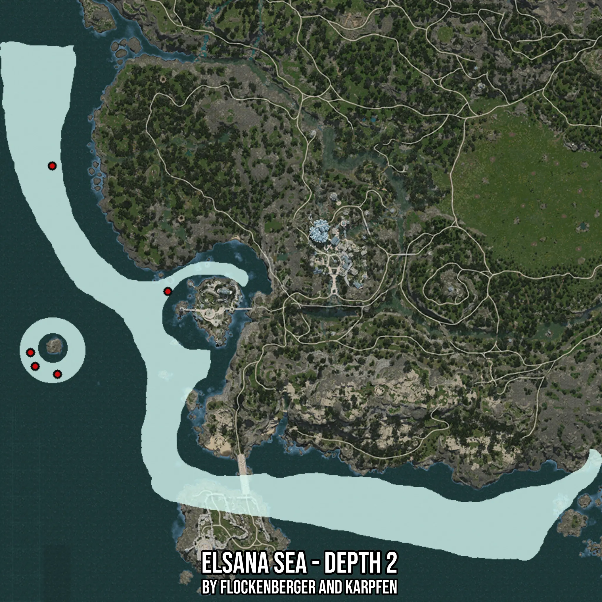

# Elsana Sea - Depth 2
Created by **flockenberger**

- **Red Points**: Exact in-game waypoints.
- **Colored Areas**: Entire area where the fishing table is consistent.
## ⚠️ Info about your float:
To verify your fishing position without modifying your files, you can do so [here](https://flockenberger.github.io/bdo-fish-position/).
- Or watch the guide [here](https://youtu.be/t-VXcRoNojk)

## Waypoints
Below you'll find the Copy-Paste ready XML file for this Fishing-Zone.

```xml
	<!--
		Waypoints for: Elsana Sea - Depth 2
		Auto-Generated by: flockenberger
		Preview at: https://github.com/Flockenberger/bdo-fish-waypoints/tree/main/Bookmark/Elsana%20Sea%20-%20Depth%202
	-->
	<WorldmapBookMark>
		<BookMark BookMarkName="1: Elsana Sea - Depth 2" PosX="-581571.7360258102" PosY="-8175.0" PosZ="-472545.93164920807" />
		<BookMark BookMarkName="2: Elsana Sea - Depth 2" PosX="-632169.3840742111" PosY="-8175.0" PosZ="-510494.1676855087" />
		<BookMark BookMarkName="3: Elsana Sea - Depth 2" PosX="-644517.6196098328" PosY="-8175.0" PosZ="-500555.3439617157" />
		<BookMark BookMarkName="4: Elsana Sea - Depth 2" PosX="-634578.7958860397" PosY="-8175.0" PosZ="-415021.2246417999" />
		<BookMark BookMarkName="5: Elsana Sea - Depth 2" PosX="-642409.3842744827" PosY="-8175.0" PosZ="-506880.0499677658" />
	</WorldmapBookMark>
```

## Usage Guide
[](https://youtu.be/W-bWmKdv8K8)

## Previews
     

 