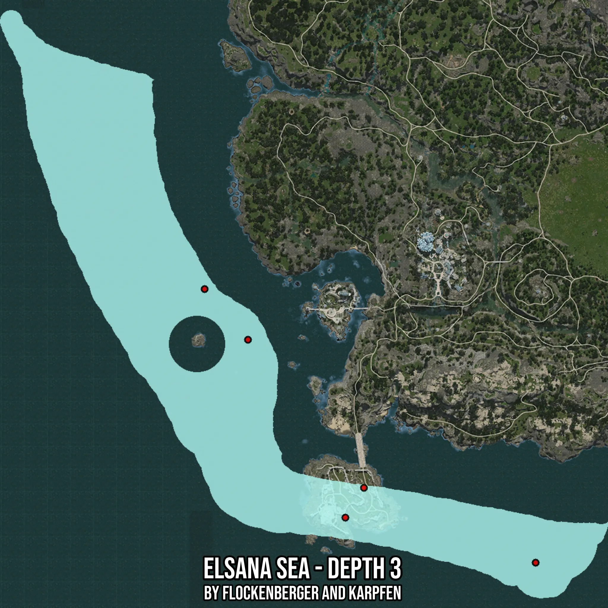

# Elsana Sea - Depth 3
Created by **flockenberger**

- **Red Points**: Exact in-game waypoints.
- **Colored Areas**: Entire area where the fishing table is consistent.
## ⚠️ Info about your float:
To verify your fishing position without modifying your files, you can do so [here](https://flockenberger.github.io/bdo-fish-position/).
- Or watch the guide [here](https://youtu.be/t-VXcRoNojk)

## Waypoints
Below you'll find the Copy-Paste ready XML file for this Fishing-Zone.

```xml
	<!--
		Waypoints for: Elsana Sea - Depth 3
		Auto-Generated by: flockenberger
		Preview at: https://github.com/Flockenberger/bdo-fish-waypoints/tree/main/Bookmark/Elsana%20Sea%20-%20Depth%203
	-->
	<WorldmapBookMark>
		<BookMark BookMarkName="1: Elsana Sea - Depth 3" PosX="-555068.2060956955" PosY="-8175.0" PosZ="-592414.1692876816" />
		<BookMark BookMarkName="2: Elsana Sea - Depth 3" PosX="-545129.3823719025" PosY="-8175.0" PosZ="-576451.816034317" />
		<BookMark BookMarkName="3: Elsana Sea - Depth 3" PosX="-453270.5570459366" PosY="-8175.0" PosZ="-616508.2874059677" />
		<BookMark BookMarkName="4: Elsana Sea - Depth 3" PosX="-607171.7365264893" PosY="-8175.0" PosZ="-497242.40272045135" />
		<BookMark BookMarkName="5: Elsana Sea - Depth 3" PosX="-630362.3252153397" PosY="-8175.0" PosZ="-470136.51983737946" />
	</WorldmapBookMark>
```

## Usage Guide
[](https://youtu.be/W-bWmKdv8K8)

## Previews
     

 