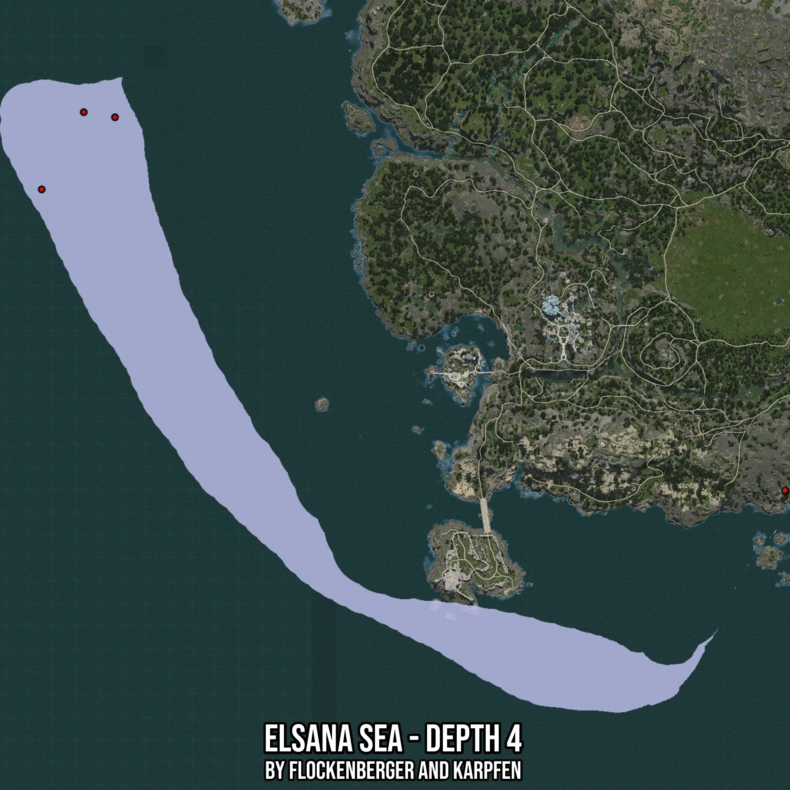

# Elsana Sea - Depth 4
Created by **flockenberger**

- **Red Points**: Exact in-game waypoints.
- **Colored Areas**: Entire area where the fishing table is consistent.
## ⚠️ Info about your float:
To verify your fishing position without modifying your files, you can do so [here](https://flockenberger.github.io/bdo-fish-position/).
- Or watch the guide [here](https://youtu.be/t-VXcRoNojk)

## Waypoints
Below you'll find the Copy-Paste ready XML file for this Fishing-Zone.

```xml
	<!--
		Waypoints for: Elsana Sea - Depth 4
		Auto-Generated by: flockenberger
		Preview at: https://github.com/Flockenberger/bdo-fish-waypoints/tree/main/Bookmark/Elsana%20Sea%20-%20Depth%204
	-->
	<WorldmapBookMark>
		<BookMark BookMarkName="1: Elsana Sea - Depth 4" PosX="-759868.2101011276" PosY="-8175.0" PosZ="-342437.69381046295" />
		<BookMark BookMarkName="2: Elsana Sea - Depth 4" PosX="-387614.0851736069" PosY="0.0" PosZ="-543924.7565746307" />
		<BookMark BookMarkName="3: Elsana Sea - Depth 4" PosX="-743303.5038948059" PosY="-8175.0" PosZ="-345148.28209877014" />
		<BookMark BookMarkName="4: Elsana Sea - Depth 4" PosX="-387915.26165008545" PosY="0.0" PosZ="-543021.227145195" />
		<BookMark BookMarkName="5: Elsana Sea - Depth 4" PosX="-782155.2693605423" PosY="-8175.0" PosZ="-383397.6946115494" />
	</WorldmapBookMark>
```

## Usage Guide
[](https://youtu.be/W-bWmKdv8K8)

## Previews
     

 