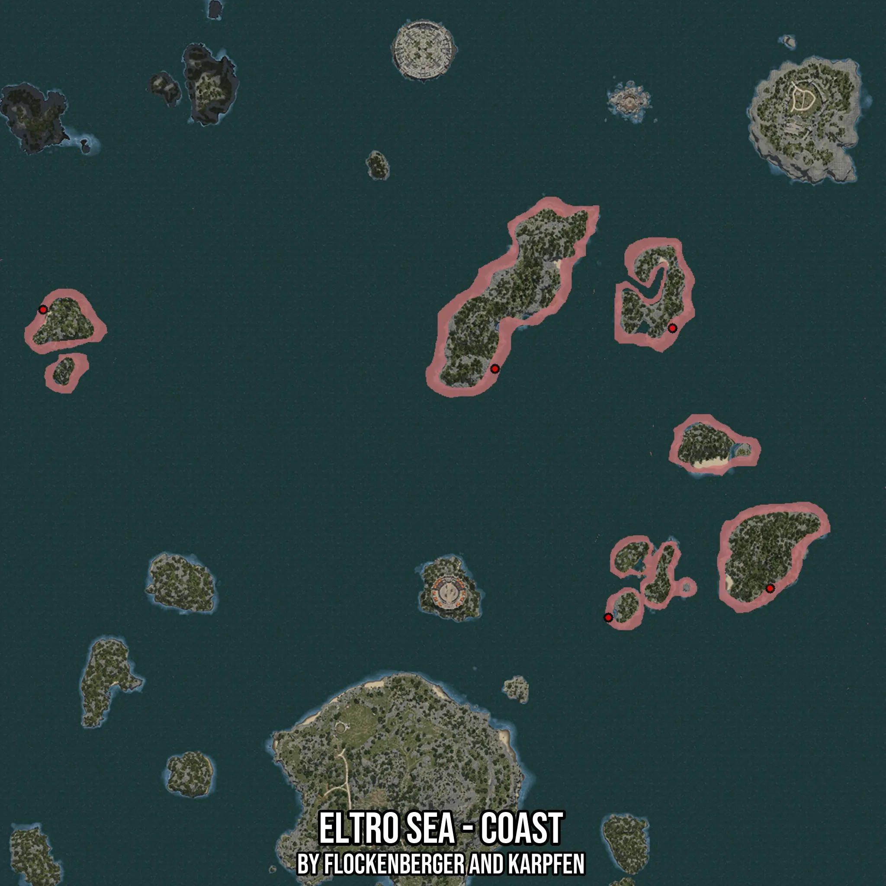

# Eltro Sea - Coast
Created by **flockenberger**

- **Red Points**: Exact in-game waypoints.
- **Colored Areas**: Entire area where the fishing table is consistent.
## ⚠️ Info about your float:
To verify your fishing position without modifying your files, you can do so [here](https://flockenberger.github.io/bdo-fish-position/).
- Or watch the guide [here](https://youtu.be/t-VXcRoNojk)

## Waypoints
Below you'll find the Copy-Paste ready XML file for this Fishing-Zone.

```xml
	<!--
		Waypoints for: Eltro Sea - Coast
		Auto-Generated by: flockenberger
		Preview at: https://github.com/Flockenberger/bdo-fish-waypoints/tree/main/Bookmark/Eltro%20Sea%20-%20Coast
	-->
	<WorldmapBookMark>
		<BookMark BookMarkName="1: Eltro Sea - Coast" PosX="203294.16167736053" PosY="-8175.0" PosZ="498145.8520412445" />
		<BookMark BookMarkName="2: Eltro Sea - Coast" PosX="278287.1043205261" PosY="-8175.0" PosZ="515312.9112005234" />
		<BookMark BookMarkName="3: Eltro Sea - Coast" PosX="319548.2815980911" PosY="-8175.0" PosZ="405383.4972858429" />
		<BookMark BookMarkName="4: Eltro Sea - Coast" PosX="251181.22143745422" PosY="-8175.0" PosZ="393035.26175022125" />
		<BookMark BookMarkName="5: Eltro Sea - Coast" PosX="12348.275589942932" PosY="-8175.0" PosZ="523143.49958896637" />
	</WorldmapBookMark>
```

## Usage Guide
[](https://youtu.be/W-bWmKdv8K8)

## Previews
     

 