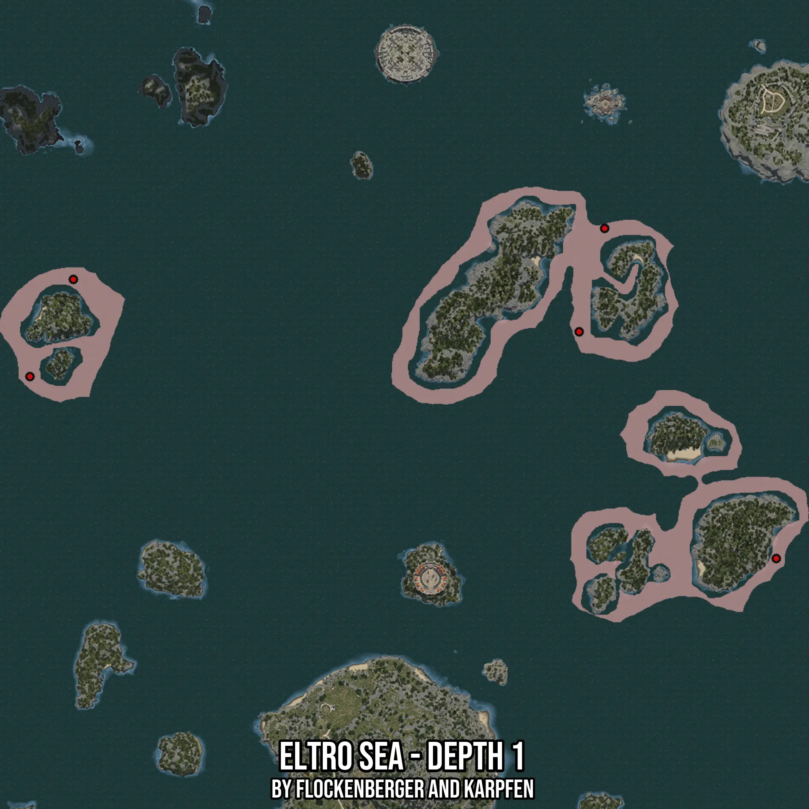

# Eltro Sea - Depth 1
Created by **flockenberger**

- **Red Points**: Exact in-game waypoints.
- **Colored Areas**: Entire area where the fishing table is consistent.
## ⚠️ Info about your float:
To verify your fishing position without modifying your files, you can do so [here](https://flockenberger.github.io/bdo-fish-position/).
- Or watch the guide [here](https://youtu.be/t-VXcRoNojk)

## Waypoints
Below you'll find the Copy-Paste ready XML file for this Fishing-Zone.

```xml
	<!--
		Waypoints for: Eltro Sea - Depth 1
		Auto-Generated by: flockenberger
		Preview at: https://github.com/Flockenberger/bdo-fish-waypoints/tree/main/Bookmark/Eltro%20Sea%20-%20Depth%201
	-->
	<WorldmapBookMark>
		<BookMark BookMarkName="1: Eltro Sea - Depth 1" PosX="248771.8096256256" PosY="-8175.0" PosZ="511397.6170063019" />
		<BookMark BookMarkName="2: Eltro Sea - Depth 1" PosX="334908.28189849854" PosY="-8175.0" PosZ="412310.55624485016" />
		<BookMark BookMarkName="3: Eltro Sea - Depth 1" PosX="27708.27589035034" PosY="-8175.0" PosZ="534287.0292186737" />
		<BookMark BookMarkName="4: Eltro Sea - Depth 1" PosX="8734.157872200012" PosY="-8175.0" PosZ="491821.1460351944" />
		<BookMark BookMarkName="5: Eltro Sea - Depth 1" PosX="259915.33925533295" PosY="-8175.0" PosZ="556574.0884780884" />
	</WorldmapBookMark>
```

## Usage Guide
[](https://youtu.be/W-bWmKdv8K8)

## Previews
     

 