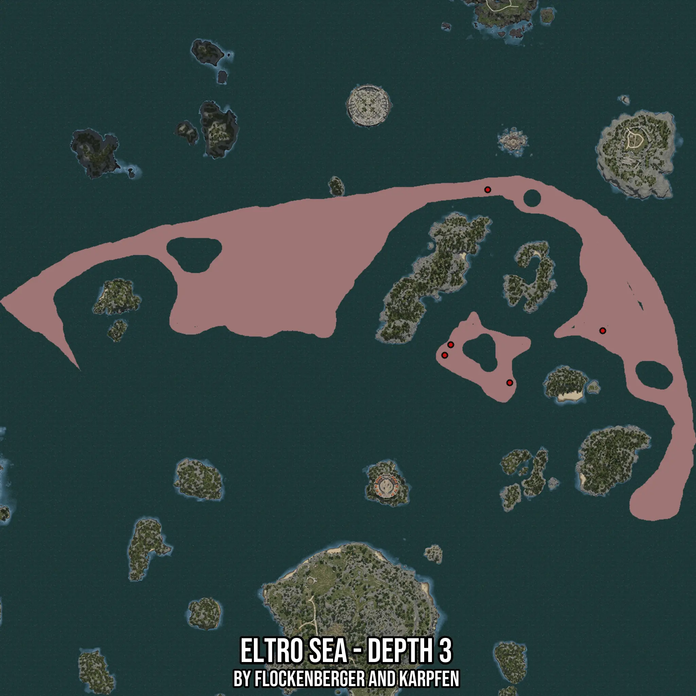

# Eltro Sea - Depth 3
Created by **flockenberger**

- **Red Points**: Exact in-game waypoints.
- **Colored Areas**: Entire area where the fishing table is consistent.
## ⚠️ Info about your float:
To verify your fishing position without modifying your files, you can do so [here](https://flockenberger.github.io/bdo-fish-position/).
- Or watch the guide [here](https://youtu.be/t-VXcRoNojk)

## Waypoints
Below you'll find the Copy-Paste ready XML file for this Fishing-Zone.

```xml
	<!--
		Waypoints for: Eltro Sea - Depth 3
		Auto-Generated by: flockenberger
		Preview at: https://github.com/Flockenberger/bdo-fish-waypoints/tree/main/Bookmark/Eltro%20Sea%20-%20Depth%203
	-->
	<WorldmapBookMark>
		<BookMark BookMarkName="1: Eltro Sea - Depth 3" PosX="244856.5154314041" PosY="-8175.0" PosZ="582174.0889787674" />
		<BookMark BookMarkName="2: Eltro Sea - Depth 3" PosX="258108.2803964615" PosY="-8175.0" PosZ="465919.9690580368" />
		<BookMark BookMarkName="3: Eltro Sea - Depth 3" PosX="218955.33845424652" PosY="-8175.0" PosZ="482484.6752643585" />
		<BookMark BookMarkName="4: Eltro Sea - Depth 3" PosX="222569.45617198944" PosY="-8175.0" PosZ="488809.38127040863" />
		<BookMark BookMarkName="5: Eltro Sea - Depth 3" PosX="314127.10502147675" PosY="-8175.0" PosZ="497242.3226118088" />
	</WorldmapBookMark>
```

## Usage Guide
[](https://youtu.be/W-bWmKdv8K8)

## Previews
     

 