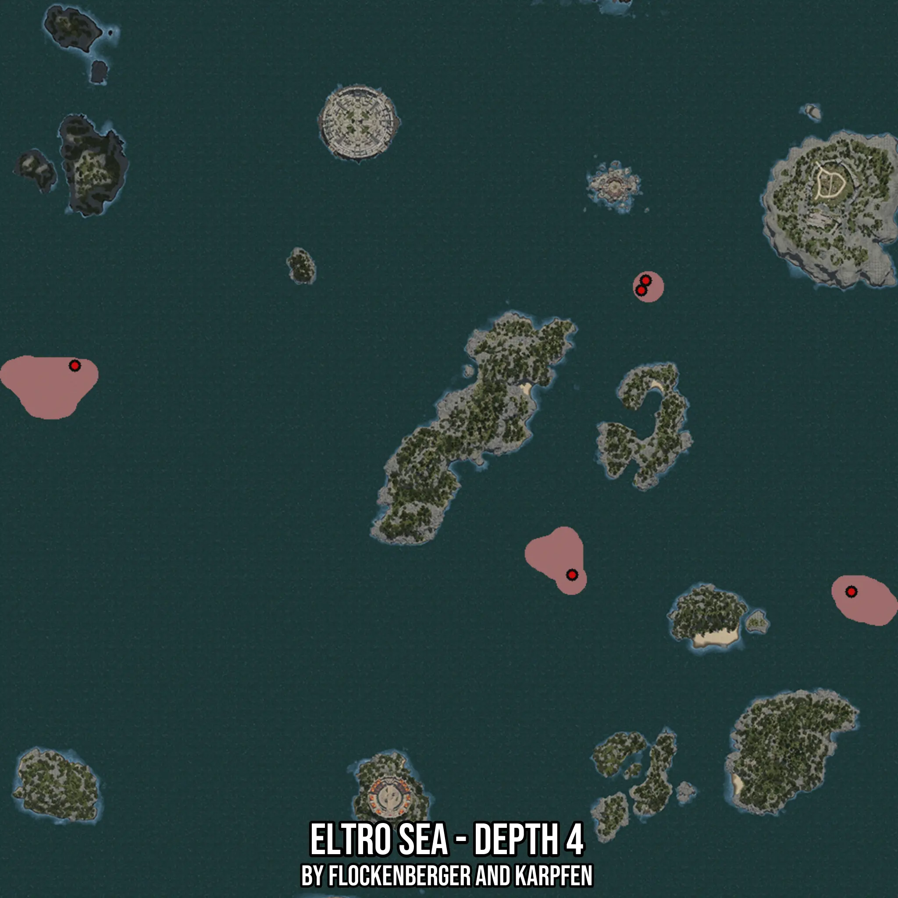

# Eltro Sea - Depth 4
Created by **flockenberger**

- **Red Points**: Exact in-game waypoints.
- **Colored Areas**: Entire area where the fishing table is consistent.
## ⚠️ Info about your float:
To verify your fishing position without modifying your files, you can do so [here](https://flockenberger.github.io/bdo-fish-position/).
- Or watch the guide [here](https://youtu.be/t-VXcRoNojk)

## Waypoints
Below you'll find the Copy-Paste ready XML file for this Fishing-Zone.

```xml
	<!--
		Waypoints for: Eltro Sea - Depth 4
		Auto-Generated by: flockenberger
		Preview at: https://github.com/Flockenberger/bdo-fish-waypoints/tree/main/Bookmark/Eltro%20Sea%20-%20Depth%204
	-->
	<WorldmapBookMark>
		<BookMark BookMarkName="1: Eltro Sea - Depth 4" PosX="76800.04155635834" PosY="-8175.0" PosZ="550249.3824720383" />
		<BookMark BookMarkName="2: Eltro Sea - Depth 4" PosX="245760.04486083984" PosY="-8175.0" PosZ="479171.7340230942" />
		<BookMark BookMarkName="3: Eltro Sea - Depth 4" PosX="340630.6349515915" PosY="-8175.0" PosZ="473449.3809700012" />
		<BookMark BookMarkName="4: Eltro Sea - Depth 4" PosX="270757.6924085617" PosY="-8175.0" PosZ="579162.3242139816" />
		<BookMark BookMarkName="5: Eltro Sea - Depth 4" PosX="269251.8100261688" PosY="-8175.0" PosZ="575849.3829727173" />
	</WorldmapBookMark>
```

## Usage Guide
[](https://youtu.be/W-bWmKdv8K8)

## Previews
     

 