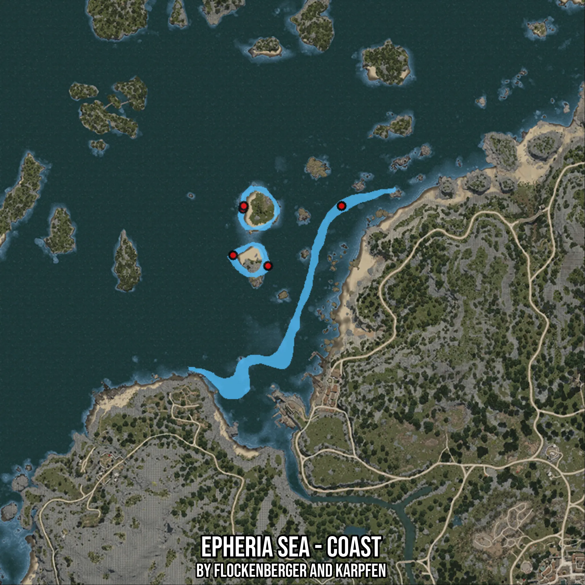

# Epheria Sea - Coast
Created by **flockenberger**

- **Red Points**: Exact in-game waypoints.
- **Colored Areas**: Entire area where the fishing table is consistent.
## ⚠️ Info about your float:
To verify your fishing position without modifying your files, you can do so [here](https://flockenberger.github.io/bdo-fish-position/).
- Or watch the guide [here](https://youtu.be/t-VXcRoNojk)

## Waypoints
Below you'll find the Copy-Paste ready XML file for this Fishing-Zone.

```xml
	<!--
		Waypoints for: Epheria Sea - Coast
		Auto-Generated by: flockenberger
		Preview at: https://github.com/Flockenberger/bdo-fish-waypoints/tree/main/Bookmark/Epheria%20Sea%20-%20Coast
	-->
	<WorldmapBookMark>
		<BookMark BookMarkName="1: Epheria Sea - Coast" PosX="-348159.96675491333" PosY="-8175.0" PosZ="112037.60919570923" />
		<BookMark BookMarkName="2: Epheria Sea - Coast" PosX="-379181.1438322067" PosY="-8175.0" PosZ="86738.78517150879" />
		<BookMark BookMarkName="3: Epheria Sea - Coast" PosX="-389722.3205089569" PosY="-8175.0" PosZ="110832.90328979492" />
		<BookMark BookMarkName="4: Epheria Sea - Coast" PosX="-389421.14403247833" PosY="-8175.0" PosZ="112037.60919570923" />
		<BookMark BookMarkName="5: Epheria Sea - Coast" PosX="-393938.791179657" PosY="-8175.0" PosZ="91256.43231868744" />
	</WorldmapBookMark>
```

## Usage Guide
[](https://youtu.be/W-bWmKdv8K8)

## Previews
     

 