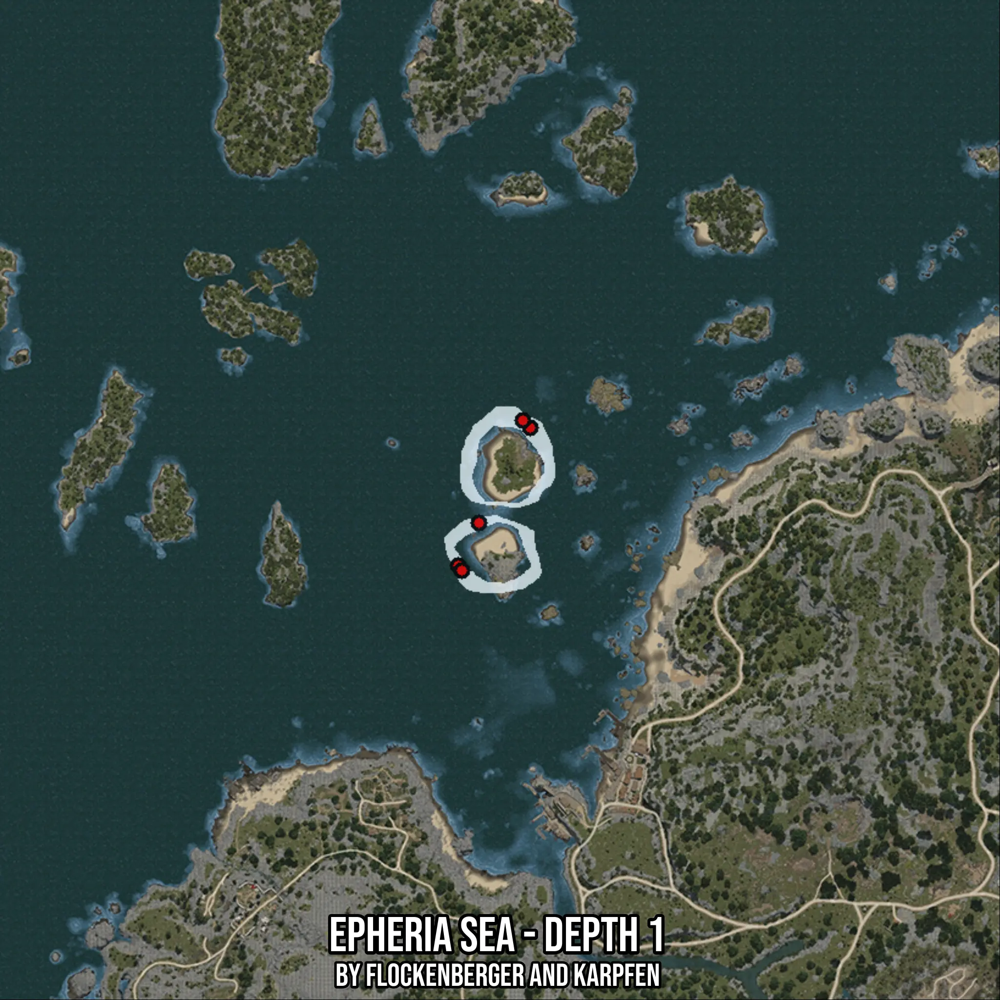

# Epheria Sea - Depth 1
Created by **flockenberger**

- **Red Points**: Exact in-game waypoints.
- **Colored Areas**: Entire area where the fishing table is consistent.
## ⚠️ Info about your float:
To verify your fishing position without modifying your files, you can do so [here](https://flockenberger.github.io/bdo-fish-position/).
- Or watch the guide [here](https://youtu.be/t-VXcRoNojk)

## Waypoints
Below you'll find the Copy-Paste ready XML file for this Fishing-Zone.

```xml
	<!--
		Waypoints for: Epheria Sea - Depth 1
		Auto-Generated by: flockenberger
		Preview at: https://github.com/Flockenberger/bdo-fish-waypoints/tree/main/Bookmark/Epheria%20Sea%20-%20Depth%201
	-->
	<WorldmapBookMark>
		<BookMark BookMarkName="1: Epheria Sea - Depth 1" PosX="-377675.26144981384" PosY="-8175.0" PosZ="120169.3740606308" />
		<BookMark BookMarkName="2: Epheria Sea - Depth 1" PosX="-395444.67356204987" PosY="-8175.0" PosZ="86136.43221855164" />
		<BookMark BookMarkName="3: Epheria Sea - Depth 1" PosX="-379482.3203086853" PosY="-8175.0" PosZ="121976.43291950226" />
		<BookMark BookMarkName="4: Epheria Sea - Depth 1" PosX="-390324.67346191406" PosY="-8175.0" PosZ="96677.60889530182" />
		<BookMark BookMarkName="5: Epheria Sea - Depth 1" PosX="-394541.14413261414" PosY="-8175.0" PosZ="84931.72631263733" />
	</WorldmapBookMark>
```

## Usage Guide
[](https://youtu.be/W-bWmKdv8K8)

## Previews
     

 