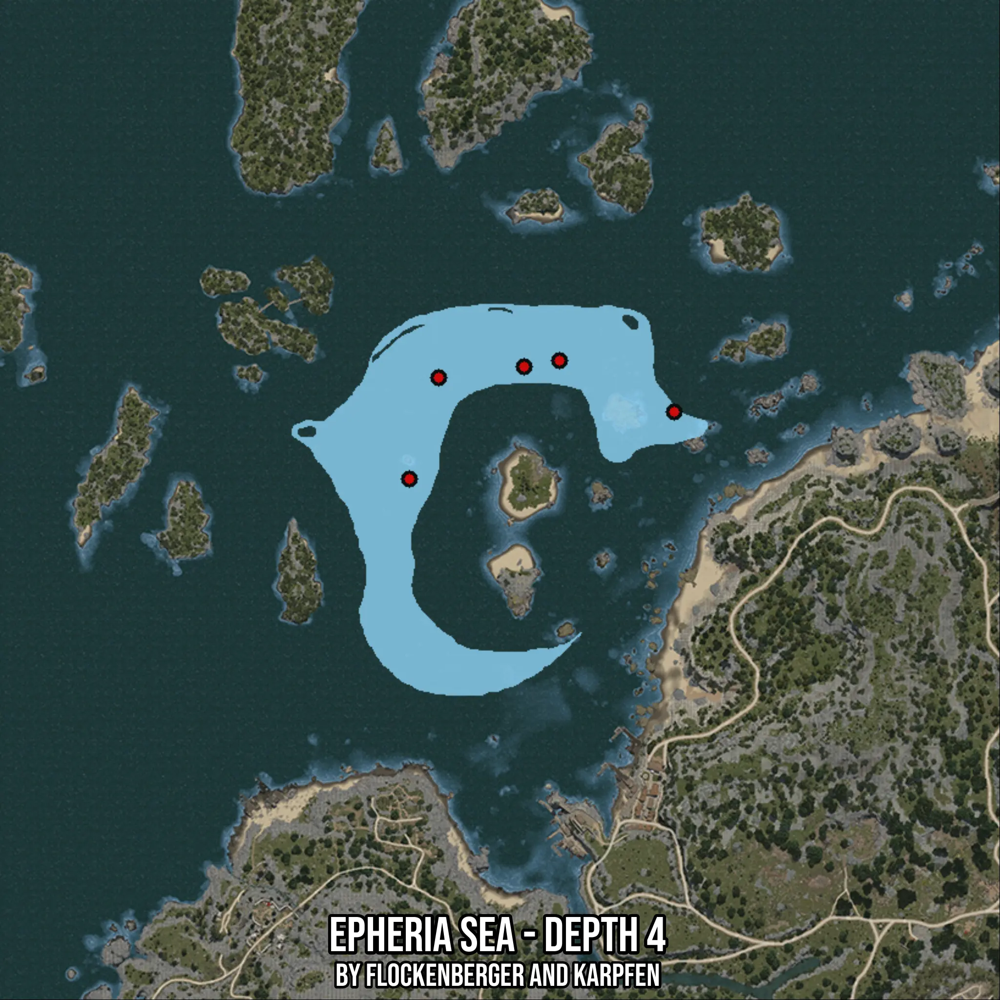

# Epheria Sea - Depth 4
Created by **flockenberger**

- **Red Points**: Exact in-game waypoints.
- **Colored Areas**: Entire area where the fishing table is consistent.
## ⚠️ Info about your float:
To verify your fishing position without modifying your files, you can do so [here](https://flockenberger.github.io/bdo-fish-position/).
- Or watch the guide [here](https://youtu.be/t-VXcRoNojk)

## Waypoints
Below you'll find the Copy-Paste ready XML file for this Fishing-Zone.

```xml
	<!--
		Waypoints for: Epheria Sea - Depth 4
		Auto-Generated by: flockenberger
		Preview at: https://github.com/Flockenberger/bdo-fish-waypoints/tree/main/Bookmark/Epheria%20Sea%20-%20Depth%204
	-->
	<WorldmapBookMark>
		<BookMark BookMarkName="1: Epheria Sea - Depth 4" PosX="-346051.7314195633" PosY="-8175.0" PosZ="128301.13892555237" />
		<BookMark BookMarkName="2: Epheria Sea - Depth 4" PosX="-374362.3202085495" PosY="-8175.0" PosZ="140950.5509376526" />
		<BookMark BookMarkName="3: Epheria Sea - Depth 4" PosX="-404178.7913799286" PosY="-8175.0" PosZ="136734.08026695251" />
		<BookMark BookMarkName="4: Epheria Sea - Depth 4" PosX="-411407.0268154144" PosY="-8175.0" PosZ="111736.43271923065" />
		<BookMark BookMarkName="5: Epheria Sea - Depth 4" PosX="-383096.4380264282" PosY="-8175.0" PosZ="139444.6685552597" />
	</WorldmapBookMark>
```

## Usage Guide
[](https://youtu.be/W-bWmKdv8K8)

## Previews
     

 