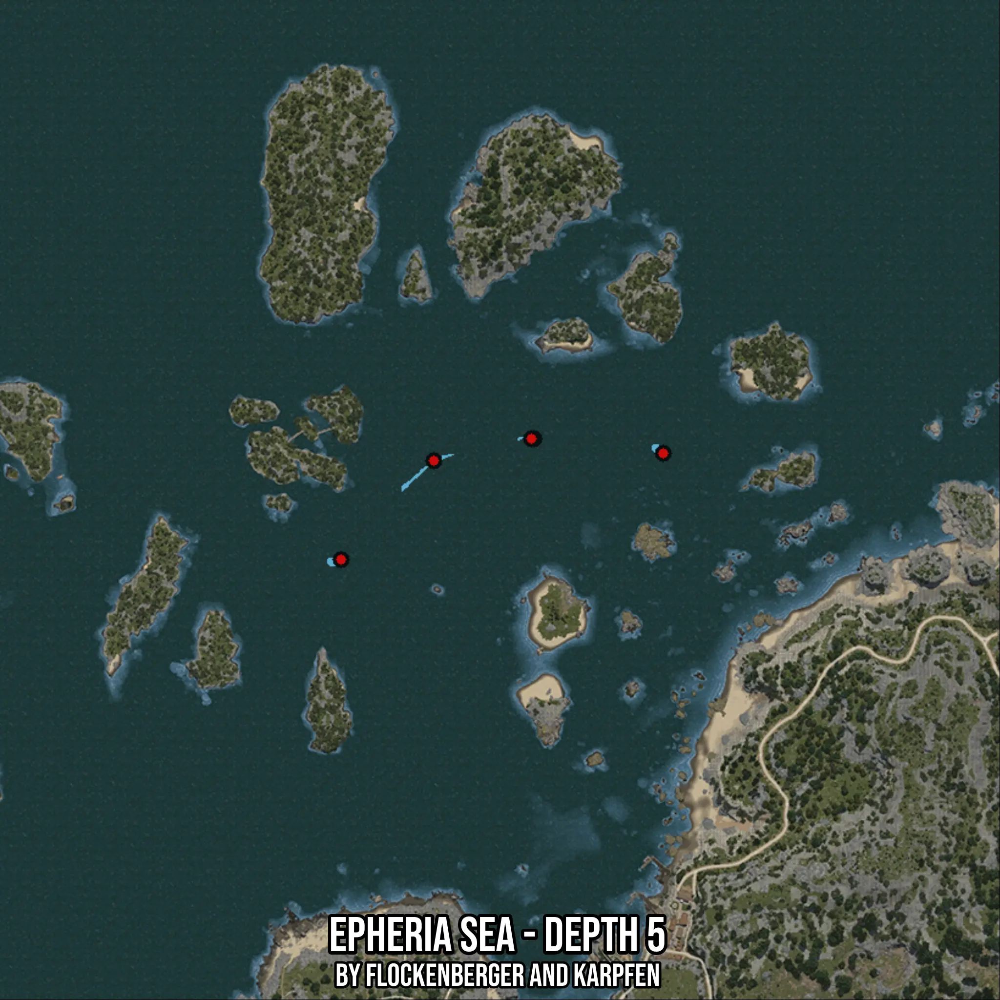

# Epheria Sea - Depth 5
Created by **flockenberger**

- **Red Points**: Exact in-game waypoints.
- **Colored Areas**: Entire area where the fishing table is consistent.
## ⚠️ Info about your float:
To verify your fishing position without modifying your files, you can do so [here](https://flockenberger.github.io/bdo-fish-position/).
- Or watch the guide [here](https://youtu.be/t-VXcRoNojk)

## Waypoints
Below you'll find the Copy-Paste ready XML file for this Fishing-Zone.

```xml
	<!--
		Waypoints for: Epheria Sea - Depth 5
		Auto-Generated by: flockenberger
		Preview at: https://github.com/Flockenberger/bdo-fish-waypoints/tree/main/Bookmark/Epheria%20Sea%20-%20Depth%205
	-->
	<WorldmapBookMark>
		<BookMark BookMarkName="1: Epheria Sea - Depth 5" PosX="-412611.73272132874" PosY="-8175.0" PosZ="148178.78637313843" />
		<BookMark BookMarkName="2: Epheria Sea - Depth 5" PosX="-435501.14493370056" PosY="-8175.0" PosZ="123783.49177837372" />
		<BookMark BookMarkName="3: Epheria Sea - Depth 5" PosX="-355990.5551433563" PosY="-8175.0" PosZ="149985.8452320099" />
		<BookMark BookMarkName="4: Epheria Sea - Depth 5" PosX="-387915.26165008545" PosY="-8175.0" PosZ="153599.9629497528" />
		<BookMark BookMarkName="5: Epheria Sea - Depth 5" PosX="-388517.6146030426" PosY="-8175.0" PosZ="153599.9629497528" />
	</WorldmapBookMark>
```

## Usage Guide
[](https://youtu.be/W-bWmKdv8K8)

## Previews
     

 