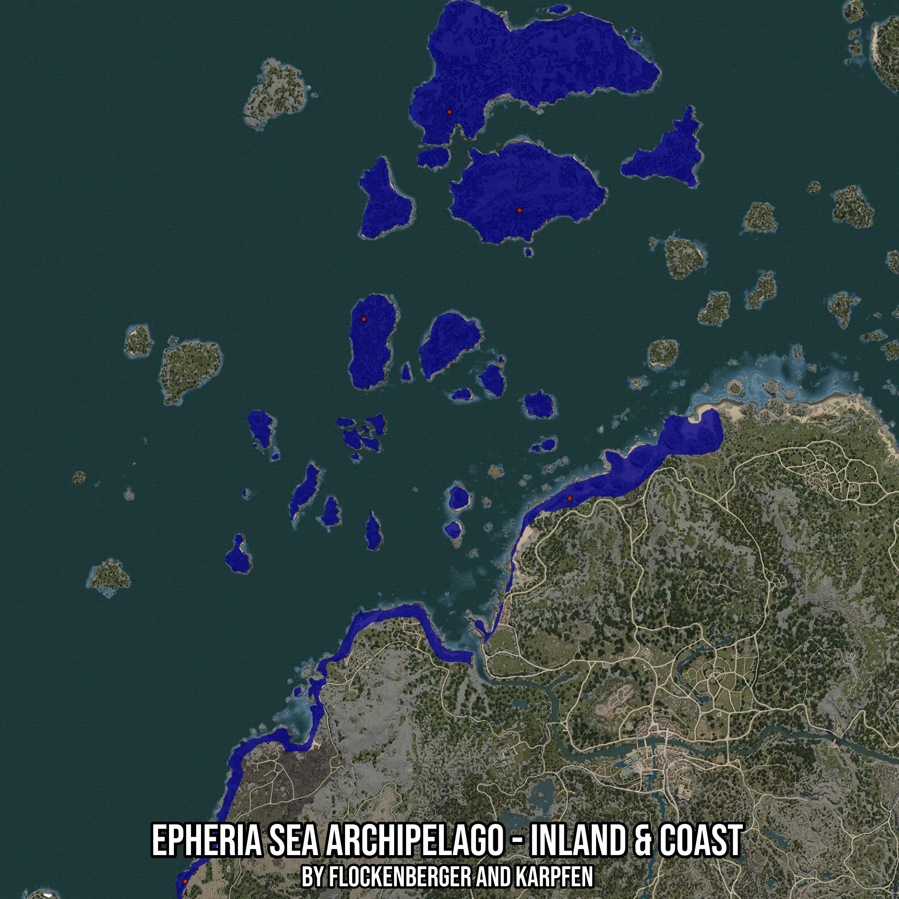

# Epheria Sea Archipelago - Inland & Coast
Created by **flockenberger**

- **Red Points**: Exact in-game waypoints.
- **Colored Areas**: Entire area where the fishing table is consistent.
## ⚠️ Info about your float:
To verify your fishing position without modifying your files, you can do so [here](https://flockenberger.github.io/bdo-fish-position/).
- Or watch the guide [here](https://youtu.be/t-VXcRoNojk)

## Waypoints
Below you'll find the Copy-Paste ready XML file for this Fishing-Zone.

```xml
	<!--
		Waypoints for: Epheria Sea Archipelago - Inland & Coast
		Auto-Generated by: flockenberger
		Preview at: https://github.com/Flockenberger/bdo-fish-waypoints/tree/main/Bookmark/Epheria%20Sea%20Archipelago%20-%20Inland%20&%20Coast
	-->
	<WorldmapBookMark>
		<BookMark BookMarkName="1: Epheria Sea Archipelago - Inland & Coast" PosX="-389119.96755599976" PosY="-8175.0" PosZ="365929.37886714935" />
		<BookMark BookMarkName="2: Epheria Sea Archipelago - Inland & Coast" PosX="-342738.79017829895" PosY="-8175.0" PosZ="300875.2599477768" />
		<BookMark BookMarkName="3: Epheria Sea Archipelago - Inland & Coast" PosX="-309609.3777656555" PosY="0.0" PosZ="110531.72681331635" />
		<BookMark BookMarkName="4: Epheria Sea Archipelago - Inland & Coast" PosX="-563802.3239135742" PosY="-8175.0" PosZ="-142757.68990516663" />
		<BookMark BookMarkName="5: Epheria Sea Archipelago - Inland & Coast" PosX="-445741.14513397217" PosY="-8175.0" PosZ="228894.08206939697" />
	</WorldmapBookMark>
```

## Usage Guide
[](https://youtu.be/W-bWmKdv8K8)

## Previews
     

 