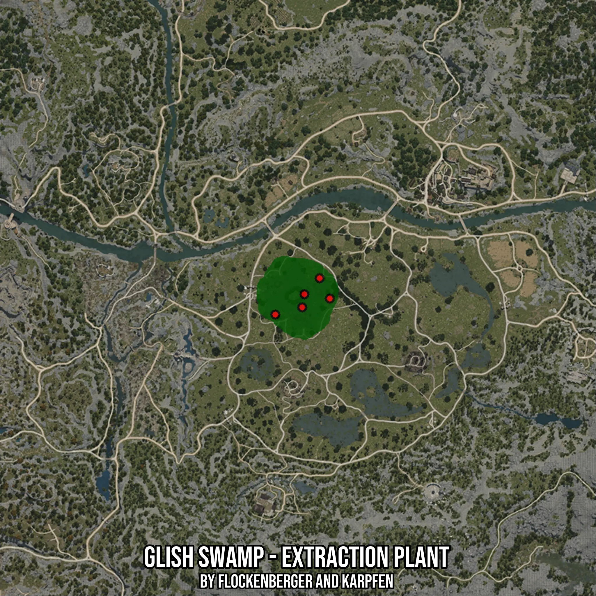

# Glish Swamp - Extraction Plant
Created by **flockenberger**

- **Red Points**: Exact in-game waypoints.
- **Colored Areas**: Entire area where the fishing table is consistent.
## ⚠️ Info about your float:
To verify your fishing position without modifying your files, you can do so [here](https://flockenberger.github.io/bdo-fish-position/).
- Or watch the guide [here](https://youtu.be/t-VXcRoNojk)

## Waypoints
Below you'll find the Copy-Paste ready XML file for this Fishing-Zone.

```xml
	<!--
		Waypoints for: Glish Swamp - Extraction Plant
		Auto-Generated by: flockenberger
		Preview at: https://github.com/Flockenberger/bdo-fish-waypoints/tree/main/Bookmark/Glish%20Swamp%20-%20Extraction%20Plant
	-->
	<WorldmapBookMark>
		<BookMark BookMarkName="1: Glish Swamp - Extraction Plant" PosX="-25298.78396987915" PosY="0.0" PosZ="-90654.15947437286" />
		<BookMark BookMarkName="2: Glish Swamp - Extraction Plant" PosX="-14155.254340171814" PosY="0.0" PosZ="-87642.3947095871" />
		<BookMark BookMarkName="3: Glish Swamp - Extraction Plant" PosX="-13251.724910736084" PosY="0.0" PosZ="-82221.21813297272" />
		<BookMark BookMarkName="4: Glish Swamp - Extraction Plant" PosX="-2710.548233985901" PosY="0.0" PosZ="-84028.27699184418" />
		<BookMark BookMarkName="5: Glish Swamp - Extraction Plant" PosX="-6927.018904685974" PosY="0.0" PosZ="-75595.33565044403" />
	</WorldmapBookMark>
```

## Usage Guide
[](https://youtu.be/W-bWmKdv8K8)

## Previews
     

 