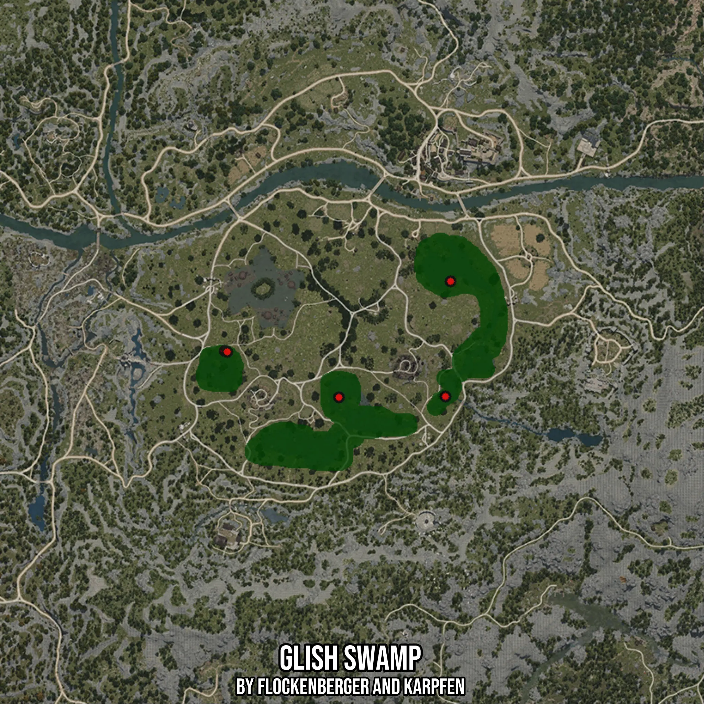

# Glish Swamp
Created by **flockenberger**

- **Red Points**: Exact in-game waypoints.
- **Colored Areas**: Entire area where the fishing table is consistent.
## ⚠️ Info about your float:
To verify your fishing position without modifying your files, you can do so [here](https://flockenberger.github.io/bdo-fish-position/).
- Or watch the guide [here](https://youtu.be/t-VXcRoNojk)

## Waypoints
Below you'll find the Copy-Paste ready XML file for this Fishing-Zone.

```xml
	<!--
		Waypoints for: Glish Swamp
		Auto-Generated by: flockenberger
		Preview at: https://github.com/Flockenberger/bdo-fish-waypoints/tree/main/Bookmark/Glish%20Swamp
	-->
	<WorldmapBookMark>
		<BookMark BookMarkName="1: Glish Swamp" PosX="46682.39390850067" PosY="0.0" PosZ="-120470.63064575195" />
		<BookMark BookMarkName="2: Glish Swamp" PosX="9336.510825157166" PosY="0.0" PosZ="-120771.80712223053" />
		<BookMark BookMarkName="3: Glish Swamp" PosX="-30719.96054649353" PosY="0.0" PosZ="-104508.27739238739" />
		<BookMark BookMarkName="4: Glish Swamp" PosX="-29816.4311170578" PosY="0.0" PosZ="-104809.45386886597" />
		<BookMark BookMarkName="5: Glish Swamp" PosX="48489.45276737213" PosY="0.0" PosZ="-80112.98279762268" />
	</WorldmapBookMark>
```

## Usage Guide
[](https://youtu.be/W-bWmKdv8K8)

## Previews
     

 