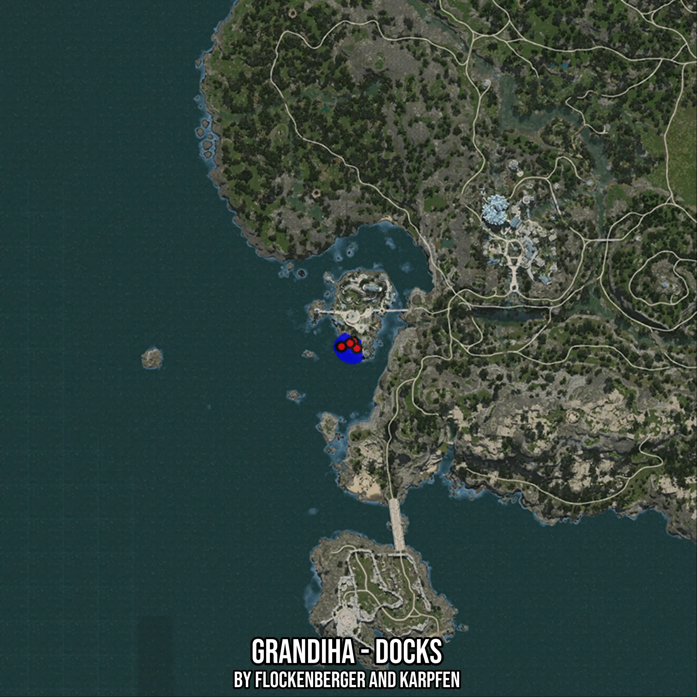

# Grandiha - Docks
Created by **flockenberger**

- **Red Points**: Exact in-game waypoints.
- **Colored Areas**: Entire area where the fishing table is consistent.
## ⚠️ Info about your float:
To verify your fishing position without modifying your files, you can do so [here](https://flockenberger.github.io/bdo-fish-position/).
- Or watch the guide [here](https://youtu.be/t-VXcRoNojk)

## Waypoints
Below you'll find the Copy-Paste ready XML file for this Fishing-Zone.

```xml
	<!--
		Waypoints for: Grandiha - Docks
		Auto-Generated by: flockenberger
		Preview at: https://github.com/Flockenberger/bdo-fish-waypoints/tree/main/Bookmark/Grandiha%20-%20Docks
	-->
	<WorldmapBookMark>
		<BookMark BookMarkName="1: Grandiha - Docks" PosX="-562296.4415311813" PosY="-8175.0" PosZ="-491520.0496673584" />
		<BookMark BookMarkName="2: Grandiha - Docks" PosX="-566814.08867836" PosY="-8175.0" PosZ="-493327.10852622986" />
		<BookMark BookMarkName="3: Grandiha - Docks" PosX="-561091.735625267" PosY="-8175.0" PosZ="-493929.461479187" />
		<BookMark BookMarkName="4: Grandiha - Docks" PosX="-566512.9122018814" PosY="-8175.0" PosZ="-493327.10852622986" />
		<BookMark BookMarkName="5: Grandiha - Docks" PosX="-563501.1474370956" PosY="-8175.0" PosZ="-492122.40262031555" />
	</WorldmapBookMark>
```

## Usage Guide
[](https://youtu.be/W-bWmKdv8K8)

## Previews
     

 