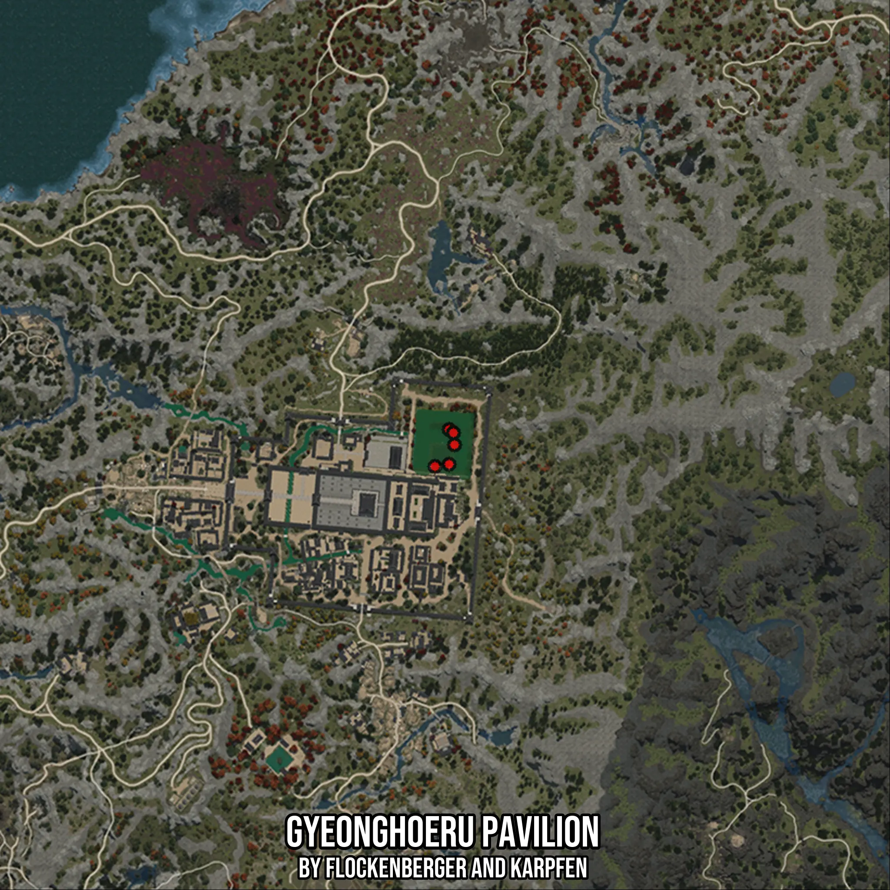

# Gyeonghoeru Pavilion
Created by **flockenberger**

- **Red Points**: Exact in-game waypoints.
- **Colored Areas**: Entire area where the fishing table is consistent.
## ⚠️ Info about your float:
To verify your fishing position without modifying your files, you can do so [here](https://flockenberger.github.io/bdo-fish-position/).
- Or watch the guide [here](https://youtu.be/t-VXcRoNojk)

## Waypoints
Below you'll find the Copy-Paste ready XML file for this Fishing-Zone.

```xml
	<!--
		Waypoints for: Gyeonghoeru Pavilion
		Auto-Generated by: flockenberger
		Preview at: https://github.com/Flockenberger/bdo-fish-waypoints/tree/main/Bookmark/Gyeonghoeru%20Pavilion
	-->
	<WorldmapBookMark>
		<BookMark BookMarkName="1: Gyeonghoeru Pavilion" PosX="-1395049.3989944458" PosY="0.0" PosZ="1344451.750946045" />
		<BookMark BookMarkName="2: Gyeonghoeru Pavilion" PosX="-1395049.3989944458" PosY="0.0" PosZ="1354089.3981933594" />
		<BookMark BookMarkName="3: Gyeonghoeru Pavilion" PosX="-1393543.516612053" PosY="0.0" PosZ="1349872.9275226593" />
		<BookMark BookMarkName="4: Gyeonghoeru Pavilion" PosX="-1393844.6930885315" PosY="0.0" PosZ="1353185.8687639236" />
		<BookMark BookMarkName="5: Gyeonghoeru Pavilion" PosX="-1398964.6931886673" PosY="0.0" PosZ="1343849.3979930878" />
	</WorldmapBookMark>
```

## Usage Guide
[](https://youtu.be/W-bWmKdv8K8)

## Previews
     

 