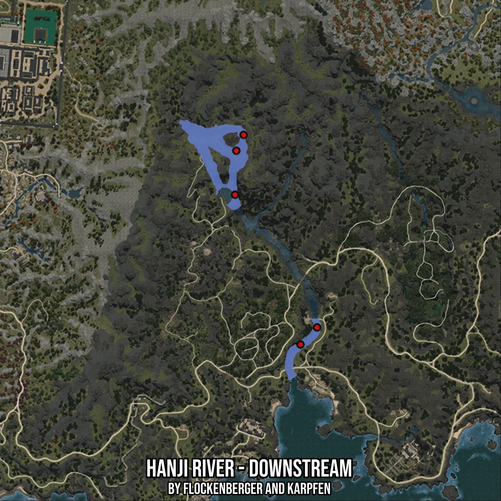

# Hanji River - Downstream
Created by **flockenberger**

- **Red Points**: Exact in-game waypoints.
- **Colored Areas**: Entire area where the fishing table is consistent.
## ⚠️ Info about your float:
To verify your fishing position without modifying your files, you can do so [here](https://flockenberger.github.io/bdo-fish-position/).
- Or watch the guide [here](https://youtu.be/t-VXcRoNojk)

## Waypoints
Below you'll find the Copy-Paste ready XML file for this Fishing-Zone.

```xml
	<!--
		Waypoints for: Hanji River - Downstream
		Auto-Generated by: flockenberger
		Preview at: https://github.com/Flockenberger/bdo-fish-waypoints/tree/main/Bookmark/Hanji%20River%20-%20Downstream
	-->
	<WorldmapBookMark>
		<BookMark BookMarkName="1: Hanji River - Downstream" PosX="-1301383.5148096085" PosY="0.0" PosZ="1268254.102396965" />
		<BookMark BookMarkName="2: Hanji River - Downstream" PosX="-1269157.6318264008" PosY="0.0" PosZ="1194465.8656597137" />
		<BookMark BookMarkName="3: Hanji River - Downstream" PosX="-1297167.0441389084" PosY="0.0" PosZ="1297769.3970918655" />
		<BookMark BookMarkName="4: Hanji River - Downstream" PosX="-1261025.8669614792" PosY="0.0" PosZ="1202898.807001114" />
		<BookMark BookMarkName="5: Hanji River - Downstream" PosX="-1300781.1618566513" PosY="0.0" PosZ="1289938.8087034225" />
	</WorldmapBookMark>
```

## Usage Guide
[](https://youtu.be/W-bWmKdv8K8)

## Previews
     

 