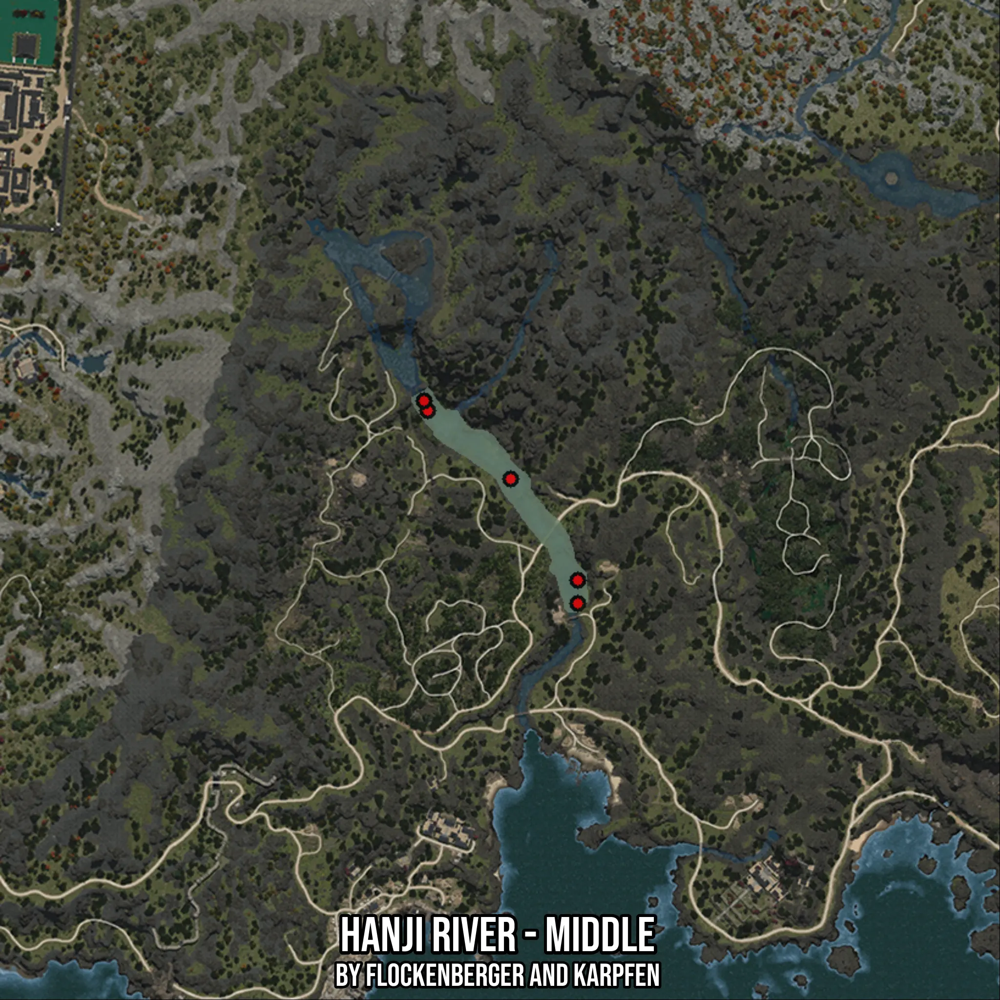

# Hanji River - Middle
Created by **flockenberger**

- **Red Points**: Exact in-game waypoints.
- **Colored Areas**: Entire area where the fishing table is consistent.
## ⚠️ Info about your float:
To verify your fishing position without modifying your files, you can do so [here](https://flockenberger.github.io/bdo-fish-position/).
- Or watch the guide [here](https://youtu.be/t-VXcRoNojk)

## Waypoints
Below you'll find the Copy-Paste ready XML file for this Fishing-Zone.

```xml
	<!--
		Waypoints for: Hanji River - Middle
		Auto-Generated by: flockenberger
		Preview at: https://github.com/Flockenberger/bdo-fish-waypoints/tree/main/Bookmark/Hanji%20River%20-%20Middle
	-->
	<WorldmapBookMark>
		<BookMark BookMarkName="1: Hanji River - Middle" PosX="-1298070.573568344" PosY="0.0" PosZ="1257110.5727672577" />
		<BookMark BookMarkName="2: Hanji River - Middle" PosX="-1298974.1029977798" PosY="0.0" PosZ="1259519.9845790863" />
		<BookMark BookMarkName="3: Hanji River - Middle" PosX="-1277590.573167801" PosY="0.0" PosZ="1240244.6900844574" />
		<BookMark BookMarkName="4: Hanji River - Middle" PosX="-1261025.8669614792" PosY="0.0" PosZ="1209524.6894836426" />
		<BookMark BookMarkName="5: Hanji River - Middle" PosX="-1261025.8669614792" PosY="0.0" PosZ="1215247.0425367355" />
	</WorldmapBookMark>
```

## Usage Guide
[](https://youtu.be/W-bWmKdv8K8)

## Previews
     

 