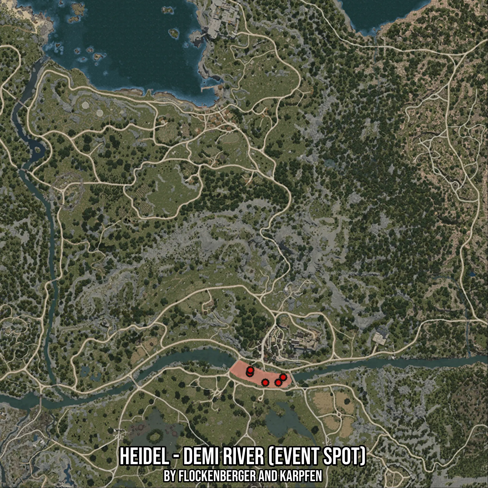

# Heidel - Demi River (Event Spot)
Created by **flockenberger**

- **Red Points**: Exact in-game waypoints.
- **Colored Areas**: Entire area where the fishing table is consistent.
## ⚠️ Info about your float:
To verify your fishing position without modifying your files, you can do so [here](https://flockenberger.github.io/bdo-fish-position/).
- Or watch the guide [here](https://youtu.be/t-VXcRoNojk)

## Waypoints
Below you'll find the Copy-Paste ready XML file for this Fishing-Zone.

```xml
	<!--
		Waypoints for: Heidel - Demi River (Event Spot)
		Auto-Generated by: flockenberger
		Preview at: https://github.com/Flockenberger/bdo-fish-waypoints/tree/main/Bookmark/Heidel%20-%20Demi%20River%20(Event%20Spot)
	-->
	<WorldmapBookMark>
		<BookMark BookMarkName="1: Heidel - Demi River (Event Spot)" PosX="47585.9233379364" PosY="0.0" PosZ="-52705.923438072205" />
		<BookMark BookMarkName="2: Heidel - Demi River (Event Spot)" PosX="38550.6290435791" PosY="0.0" PosZ="-55416.511726379395" />
		<BookMark BookMarkName="3: Heidel - Demi River (Event Spot)" PosX="30720.04065513611" PosY="0.0" PosZ="-50597.68810272217" />
		<BookMark BookMarkName="4: Heidel - Demi River (Event Spot)" PosX="45176.51152610779" PosY="0.0" PosZ="-55416.511726379395" />
		<BookMark BookMarkName="5: Heidel - Demi River (Event Spot)" PosX="31021.217131614685" PosY="0.0" PosZ="-49091.805720329285" />
	</WorldmapBookMark>
```

## Usage Guide
[](https://youtu.be/W-bWmKdv8K8)

## Previews
     

 