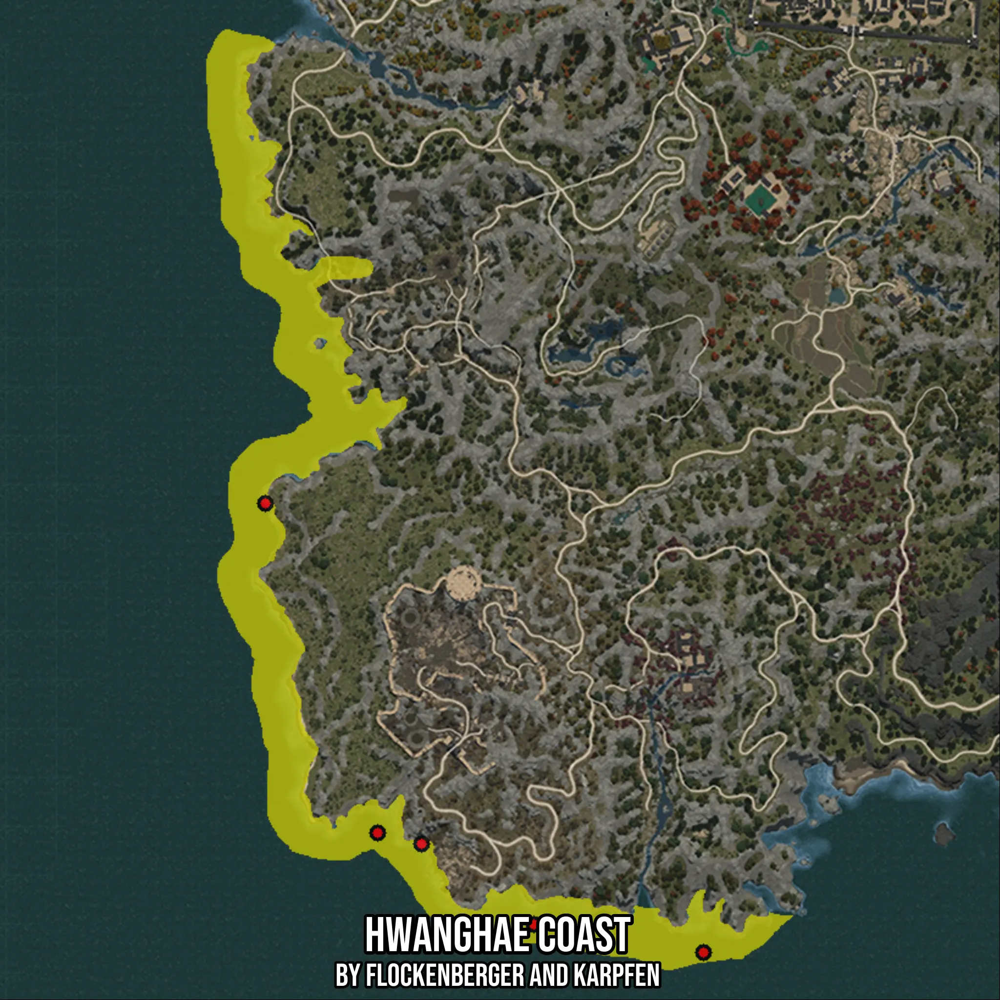

# Hwanghae Coast
Created by **flockenberger**

- **Red Points**: Exact in-game waypoints.
- **Colored Areas**: Entire area where the fishing table is consistent.
## ⚠️ Info about your float:
To verify your fishing position without modifying your files, you can do so [here](https://flockenberger.github.io/bdo-fish-position/).
- Or watch the guide [here](https://youtu.be/t-VXcRoNojk)

## Waypoints
Below you'll find the Copy-Paste ready XML file for this Fishing-Zone.

```xml
	<!--
		Waypoints for: Hwanghae Coast
		Auto-Generated by: flockenberger
		Preview at: https://github.com/Flockenberger/bdo-fish-waypoints/tree/main/Bookmark/Hwanghae%20Coast
	-->
	<WorldmapBookMark>
		<BookMark BookMarkName="1: Hwanghae Coast" PosX="-1536602.3429393768" PosY="0.0" PosZ="1106522.3345279694" />
		<BookMark BookMarkName="2: Hwanghae Coast" PosX="-1564310.578775406" PosY="0.0" PosZ="1187839.983177185" />
		<BookMark BookMarkName="3: Hwanghae Coast" PosX="-1456188.2237195969" PosY="-8175.0" PosZ="1077007.0398330688" />
		<BookMark BookMarkName="4: Hwanghae Coast" PosX="-1498051.753950119" PosY="-8175.0" PosZ="1083934.098792076" />
		<BookMark BookMarkName="5: Hwanghae Coast" PosX="-1525759.989786148" PosY="0.0" PosZ="1103811.7462396622" />
	</WorldmapBookMark>
```

## Usage Guide
[](https://youtu.be/W-bWmKdv8K8)

## Previews
     

 