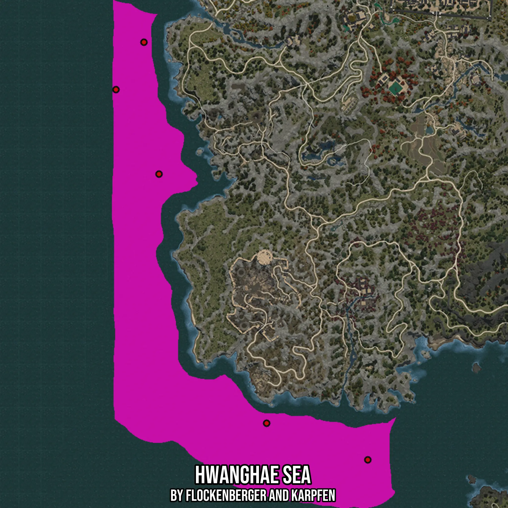

# Hwanghae Sea
Created by **flockenberger**

- **Red Points**: Exact in-game waypoints.
- **Colored Areas**: Entire area where the fishing table is consistent.
## ⚠️ Info about your float:
To verify your fishing position without modifying your files, you can do so [here](https://flockenberger.github.io/bdo-fish-position/).
- Or watch the guide [here](https://youtu.be/t-VXcRoNojk)

## Waypoints
Below you'll find the Copy-Paste ready XML file for this Fishing-Zone.

```xml
	<!--
		Waypoints for: Hwanghae Sea
		Auto-Generated by: flockenberger
		Preview at: https://github.com/Flockenberger/bdo-fish-waypoints/tree/main/Bookmark/Hwanghae%20Sea
	-->
	<WorldmapBookMark>
		<BookMark BookMarkName="1: Hwanghae Sea" PosX="-1574550.5789756775" PosY="-8175.0" PosZ="1214644.6895837784" />
		<BookMark BookMarkName="2: Hwanghae Sea" PosX="-1598644.6970939636" PosY="0.0" PosZ="1261929.396390915" />
		<BookMark BookMarkName="3: Hwanghae Sea" PosX="-1582983.5203170776" PosY="-8175.0" PosZ="1288432.9263210297" />
		<BookMark BookMarkName="4: Hwanghae Sea" PosX="-1514315.2836799622" PosY="-8175.0" PosZ="1075199.9809741974" />
		<BookMark BookMarkName="5: Hwanghae Sea" PosX="-1457694.1061019897" PosY="-8175.0" PosZ="1054719.9805736542" />
	</WorldmapBookMark>
```

## Usage Guide
[](https://youtu.be/W-bWmKdv8K8)

## Previews
     

 