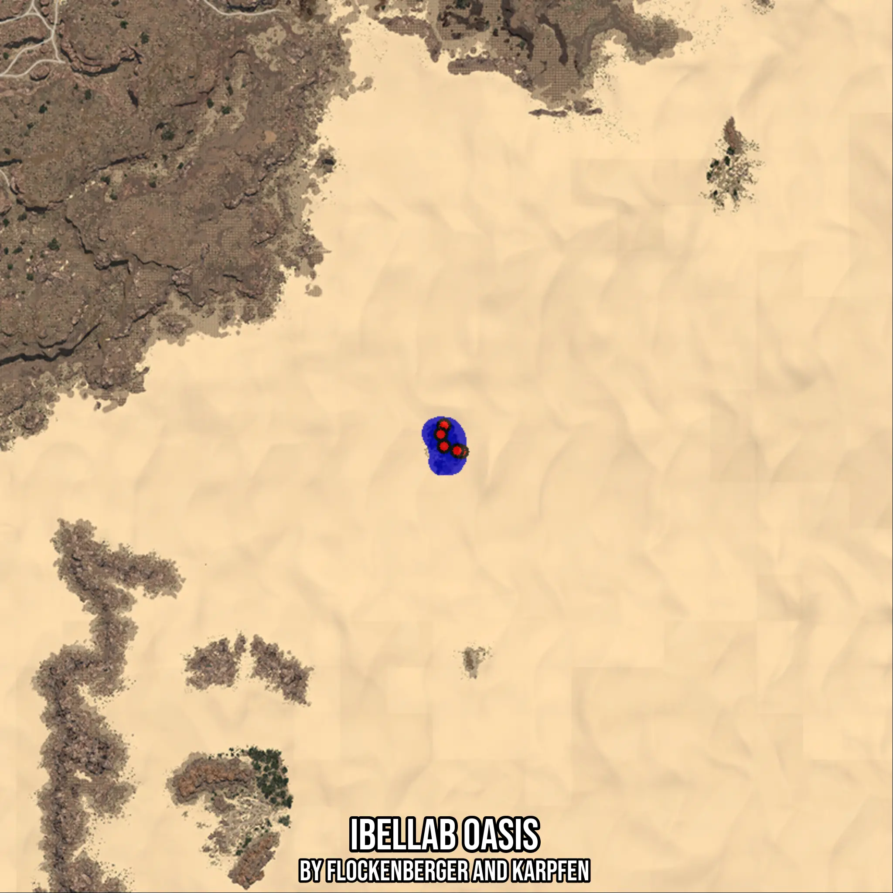

# Ibellab Oasis
Created by **flockenberger**

- **Red Points**: Exact in-game waypoints.
- **Colored Areas**: Entire area where the fishing table is consistent.
## ⚠️ Info about your float:
To verify your fishing position without modifying your files, you can do so [here](https://flockenberger.github.io/bdo-fish-position/).
- Or watch the guide [here](https://youtu.be/t-VXcRoNojk)

## Waypoints
Below you'll find the Copy-Paste ready XML file for this Fishing-Zone.

```xml
	<!--
		Waypoints for: Ibellab Oasis
		Auto-Generated by: flockenberger
		Preview at: https://github.com/Flockenberger/bdo-fish-waypoints/tree/main/Bookmark/Ibellab%20Oasis
	-->
	<WorldmapBookMark>
		<BookMark BookMarkName="1: Ibellab Oasis" PosX="732461.2308502197" PosY="0.0" PosZ="207209.37576293945" />
		<BookMark BookMarkName="2: Ibellab Oasis" PosX="737280.054473877" PosY="0.0" PosZ="199981.1403274536" />
		<BookMark BookMarkName="3: Ibellab Oasis" PosX="732461.2308502197" PosY="0.0" PosZ="201487.0227098465" />
		<BookMark BookMarkName="4: Ibellab Oasis" PosX="731557.701420784" PosY="0.0" PosZ="204799.96395111084" />
		<BookMark BookMarkName="5: Ibellab Oasis" PosX="736075.3485679626" PosY="0.0" PosZ="200282.3168039322" />
	</WorldmapBookMark>
```

## Usage Guide
[](https://youtu.be/W-bWmKdv8K8)

## Previews
     

 