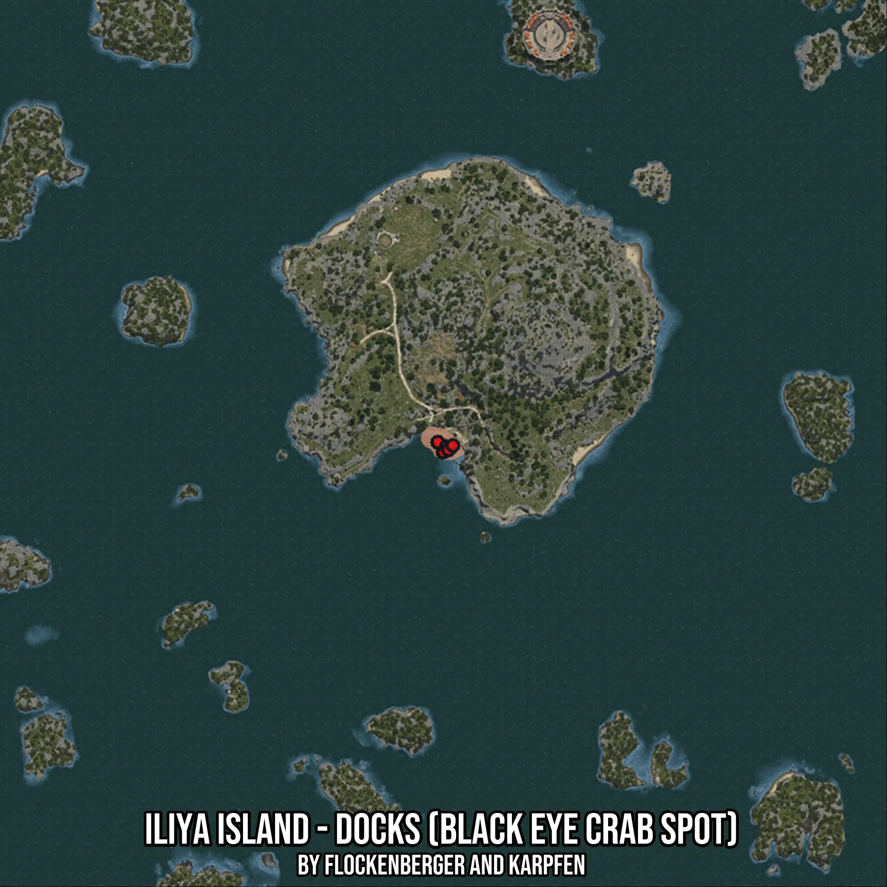

# Iliya Island - Docks (Black Eye Crab Spot)
Created by **flockenberger**

- **Red Points**: Exact in-game waypoints.
- **Colored Areas**: Entire area where the fishing table is consistent.
## ⚠️ Info about your float:
To verify your fishing position without modifying your files, you can do so [here](https://flockenberger.github.io/bdo-fish-position/).
- Or watch the guide [here](https://youtu.be/t-VXcRoNojk)

## Waypoints
Below you'll find the Copy-Paste ready XML file for this Fishing-Zone.

```xml
	<!--
		Waypoints for: Iliya Island - Docks (Black Eye Crab Spot)
		Auto-Generated by: flockenberger
		Preview at: https://github.com/Flockenberger/bdo-fish-waypoints/tree/main/Bookmark/Iliya%20Island%20-%20Docks%20(Black%20Eye%20Crab%20Spot)
	-->
	<WorldmapBookMark>
		<BookMark BookMarkName="1: Iliya Island - Docks (Black Eye Crab Spot)" PosX="154202.39601135254" PosY="-8175.0" PosZ="287623.4949827194" />
		<BookMark BookMarkName="2: Iliya Island - Docks (Black Eye Crab Spot)" PosX="152696.51362895966" PosY="-8175.0" PosZ="290334.0832710266" />
		<BookMark BookMarkName="3: Iliya Island - Docks (Black Eye Crab Spot)" PosX="155105.92544078827" PosY="-8175.0" PosZ="289129.3773651123" />
		<BookMark BookMarkName="4: Iliya Island - Docks (Black Eye Crab Spot)" PosX="155708.27839374542" PosY="-8175.0" PosZ="288225.8479356766" />
		<BookMark BookMarkName="5: Iliya Island - Docks (Black Eye Crab Spot)" PosX="156912.98429965973" PosY="-8175.0" PosZ="289430.5538415909" />
	</WorldmapBookMark>
```

## Usage Guide
[](https://youtu.be/W-bWmKdv8K8)

## Previews
     

 