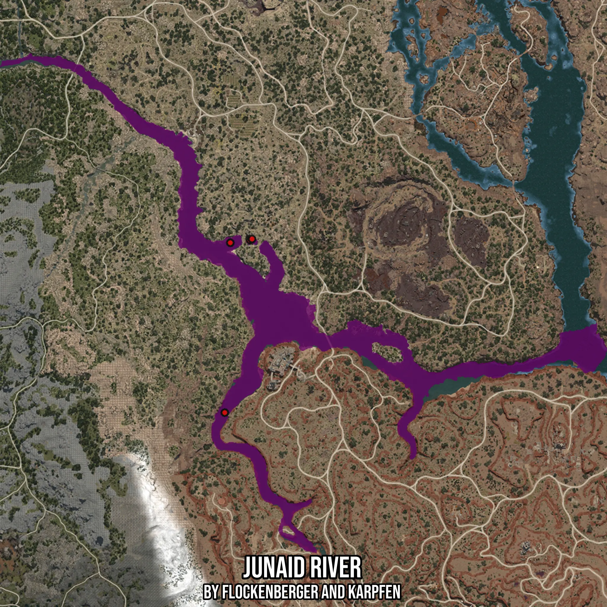

# Junaid River
Created by **flockenberger**

- **Red Points**: Exact in-game waypoints.
- **Colored Areas**: Entire area where the fishing table is consistent.
## ⚠️ Info about your float:
To verify your fishing position without modifying your files, you can do so [here](https://flockenberger.github.io/bdo-fish-position/).
- Or watch the guide [here](https://youtu.be/t-VXcRoNojk)

## Waypoints
Below you'll find the Copy-Paste ready XML file for this Fishing-Zone.

```xml
	<!--
		Waypoints for: Junaid River
		Auto-Generated by: flockenberger
		Preview at: https://github.com/Flockenberger/bdo-fish-waypoints/tree/main/Bookmark/Junaid%20River
	-->
	<WorldmapBookMark>
		<BookMark BookMarkName="1: Junaid River" PosX="240338.86828422546" PosY="0.0" PosZ="-214738.86778354645" />
		<BookMark BookMarkName="2: Junaid River" PosX="252385.92734336853" PosY="0.0" PosZ="-130409.45436954498" />
		<BookMark BookMarkName="3: Junaid River" PosX="252687.1038198471" PosY="0.0" PosZ="-131011.80732250214" />
		<BookMark BookMarkName="4: Junaid River" PosX="243049.45657253265" PosY="0.0" PosZ="-132216.51322841644" />
		<BookMark BookMarkName="5: Junaid River" PosX="253590.63324928284" PosY="0.0" PosZ="-130409.45436954498" />
	</WorldmapBookMark>
```

## Usage Guide
[](https://youtu.be/W-bWmKdv8K8)

## Previews
     

 