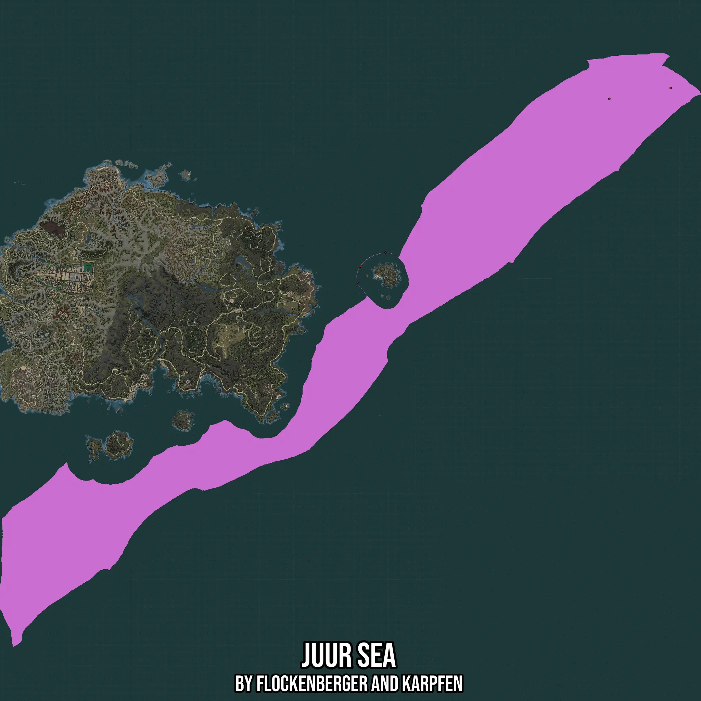

# Juur Sea
Created by **flockenberger**

- **Red Points**: Exact in-game waypoints.
- **Colored Areas**: Entire area where the fishing table is consistent.
## ⚠️ Info about your float:
To verify your fishing position without modifying your files, you can do so [here](https://flockenberger.github.io/bdo-fish-position/).
- Or watch the guide [here](https://youtu.be/t-VXcRoNojk)

## Waypoints
Below you'll find the Copy-Paste ready XML file for this Fishing-Zone.

```xml
	<!--
		Waypoints for: Juur Sea
		Auto-Generated by: flockenberger
		Preview at: https://github.com/Flockenberger/bdo-fish-waypoints/tree/main/Bookmark/Juur%20Sea
	-->
	<WorldmapBookMark>
		<BookMark BookMarkName="1: Juur Sea" PosX="-335510.5547428131" PosY="-8175.0" PosZ="1678456.4633607864" />
		<BookMark BookMarkName="2: Juur Sea" PosX="-855341.1531448364" PosY="-8175.0" PosZ="1378484.692788124" />
		<BookMark BookMarkName="3: Juur Sea" PosX="-447247.02751636505" PosY="-8175.0" PosZ="1658578.8159132004" />
		<BookMark BookMarkName="4: Juur Sea" PosX="-906239.9776697159" PosY="-8175.0" PosZ="1323369.3975925446" />
		<BookMark BookMarkName="5: Juur Sea" PosX="-901722.3305225372" PosY="-8175.0" PosZ="1352583.5158109665" />
	</WorldmapBookMark>
```

## Usage Guide
[](https://youtu.be/W-bWmKdv8K8)

## Previews
     

 