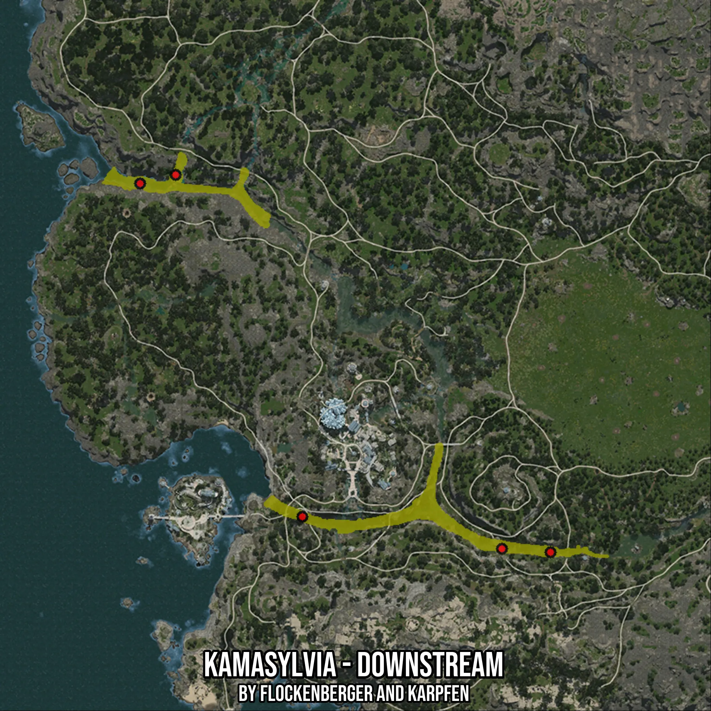

# Kamasylvia - Downstream
Created by **flockenberger**

- **Red Points**: Exact in-game waypoints.
- **Colored Areas**: Entire area where the fishing table is consistent.
## ⚠️ Info about your float:
To verify your fishing position without modifying your files, you can do so [here](https://flockenberger.github.io/bdo-fish-position/).
- Or watch the guide [here](https://youtu.be/t-VXcRoNojk)

## Waypoints
Below you'll find the Copy-Paste ready XML file for this Fishing-Zone.

```xml
	<!--
		Waypoints for: Kamasylvia - Downstream
		Auto-Generated by: flockenberger
		Preview at: https://github.com/Flockenberger/bdo-fish-waypoints/tree/main/Bookmark/Kamasylvia%20-%20Downstream
	-->
	<WorldmapBookMark>
		<BookMark BookMarkName="1: Kamasylvia - Downstream" PosX="-436705.85083961487" PosY="0.0" PosZ="-493025.9320497513" />
		<BookMark BookMarkName="2: Kamasylvia - Downstream" PosX="-566814.08867836" PosY="0.0" PosZ="-362014.16478157043" />
		<BookMark BookMarkName="3: Kamasylvia - Downstream" PosX="-453571.73352241516" PosY="0.0" PosZ="-491821.226143837" />
		<BookMark BookMarkName="4: Kamasylvia - Downstream" PosX="-522842.3231124878" PosY="0.0" PosZ="-480677.69651412964" />
		<BookMark BookMarkName="5: Kamasylvia - Downstream" PosX="-579162.3242139816" PosY="0.0" PosZ="-365025.9295463562" />
	</WorldmapBookMark>
```

## Usage Guide
[](https://youtu.be/W-bWmKdv8K8)

## Previews
     

 