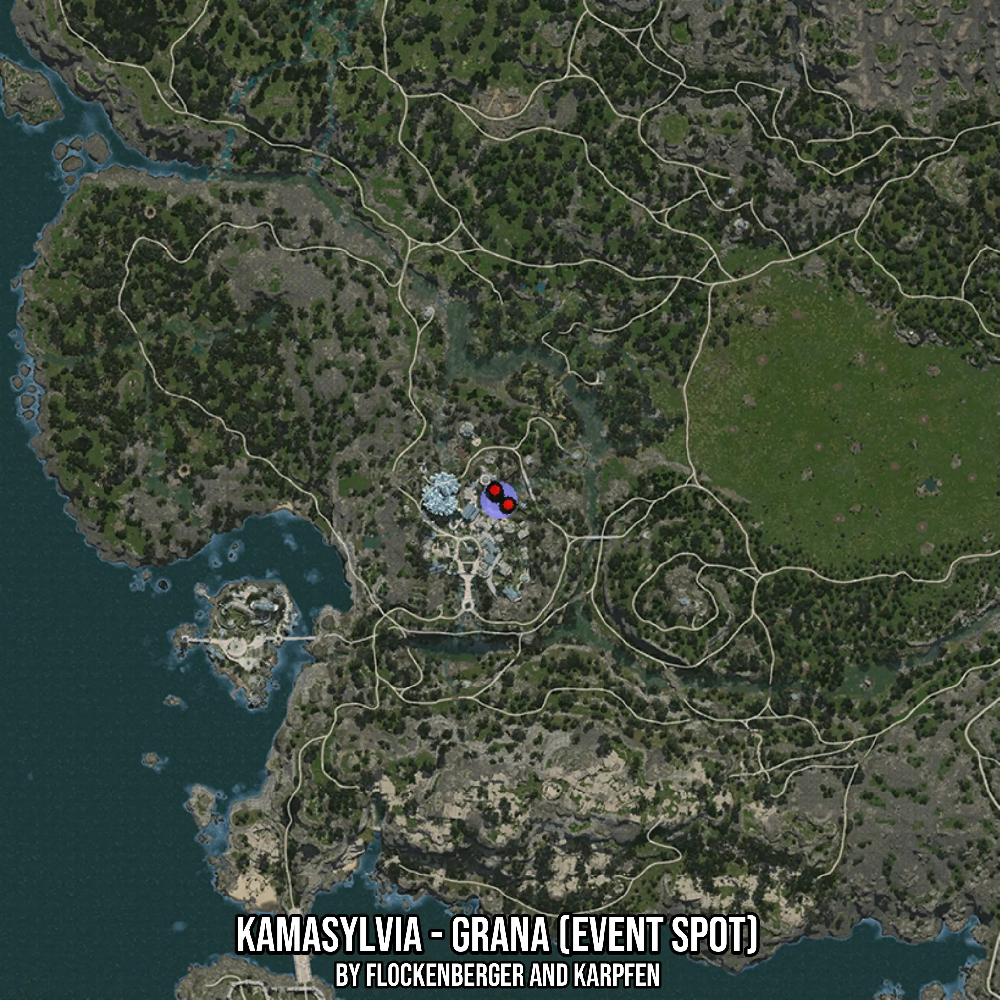

# Kamasylvia - Grana (Event Spot)
Created by **flockenberger**

- **Red Points**: Exact in-game waypoints.
- **Colored Areas**: Entire area where the fishing table is consistent.
## ⚠️ Info about your float:
To verify your fishing position without modifying your files, you can do so [here](https://flockenberger.github.io/bdo-fish-position/).
- Or watch the guide [here](https://youtu.be/t-VXcRoNojk)

## Waypoints
Below you'll find the Copy-Paste ready XML file for this Fishing-Zone.

```xml
	<!--
		Waypoints for: Kamasylvia - Grana (Event Spot)
		Auto-Generated by: flockenberger
		Preview at: https://github.com/Flockenberger/bdo-fish-waypoints/tree/main/Bookmark/Kamasylvia%20-%20Grana%20(Event%20Spot)
	-->
	<WorldmapBookMark>
		<BookMark BookMarkName="1: Kamasylvia - Grana (Event Spot)" PosX="-495736.4402294159" PosY="0.0" PosZ="-447849.4605779648" />
		<BookMark BookMarkName="2: Kamasylvia - Grana (Event Spot)" PosX="-495435.2637529373" PosY="0.0" PosZ="-447548.2841014862" />
		<BookMark BookMarkName="3: Kamasylvia - Grana (Event Spot)" PosX="-498447.0285177231" PosY="0.0" PosZ="-445138.8722896576" />
		<BookMark BookMarkName="4: Kamasylvia - Grana (Event Spot)" PosX="-499049.38147068024" PosY="0.0" PosZ="-444536.51933670044" />
		<BookMark BookMarkName="5: Kamasylvia - Grana (Event Spot)" PosX="-498748.20499420166" PosY="0.0" PosZ="-443934.1663837433" />
	</WorldmapBookMark>
```

## Usage Guide
[](https://youtu.be/W-bWmKdv8K8)

## Previews
     

 