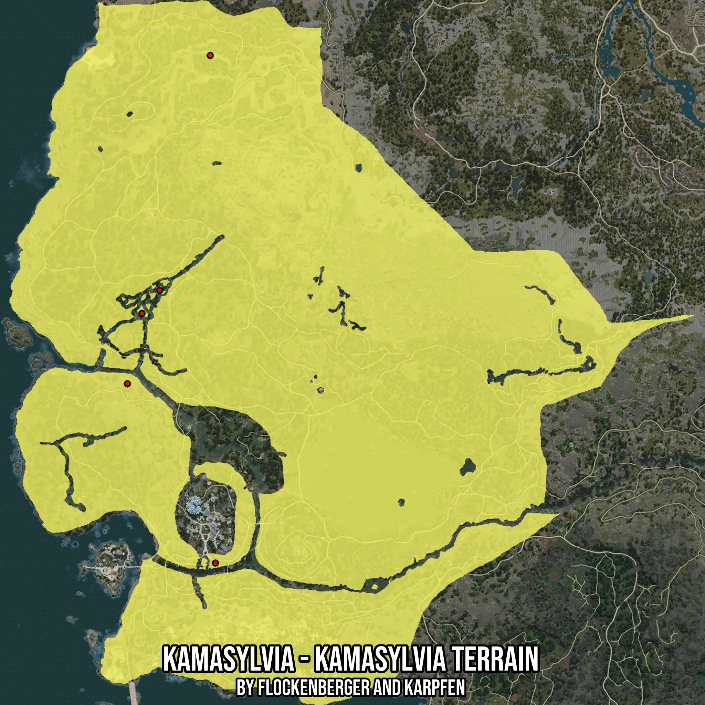

# Kamasylvia - Kamasylvia Terrain
Created by **flockenberger**

- **Red Points**: Exact in-game waypoints.
- **Colored Areas**: Entire area where the fishing table is consistent.
## ⚠️ Info about your float:
To verify your fishing position without modifying your files, you can do so [here](https://flockenberger.github.io/bdo-fish-position/).
- Or watch the guide [here](https://youtu.be/t-VXcRoNojk)

## Waypoints
Below you'll find the Copy-Paste ready XML file for this Fishing-Zone.

```xml
	<!--
		Waypoints for: Kamasylvia - Kamasylvia Terrain
		Auto-Generated by: flockenberger
		Preview at: https://github.com/Flockenberger/bdo-fish-waypoints/tree/main/Bookmark/Kamasylvia%20-%20Kamasylvia%20Terrain
	-->
	<WorldmapBookMark>
		<BookMark BookMarkName="1: Kamasylvia - Kamasylvia Terrain" PosX="-502663.49918842316" PosY="0.0" PosZ="-184922.39661216736" />
		<BookMark BookMarkName="2: Kamasylvia - Kamasylvia Terrain" PosX="-550550.5589485168" PosY="0.0" PosZ="-374663.57679367065" />
		<BookMark BookMarkName="3: Kamasylvia - Kamasylvia Terrain" PosX="-499651.7344236374" PosY="0.0" PosZ="-478268.284702301" />
		<BookMark BookMarkName="4: Kamasylvia - Kamasylvia Terrain" PosX="-531877.6174068451" PosY="0.0" PosZ="-320752.98750400543" />
		<BookMark BookMarkName="5: Kamasylvia - Kamasylvia Terrain" PosX="-542117.6176071167" PosY="0.0" PosZ="-334004.7524690628" />
	</WorldmapBookMark>
```

## Usage Guide
[](https://youtu.be/W-bWmKdv8K8)

## Previews
     

 