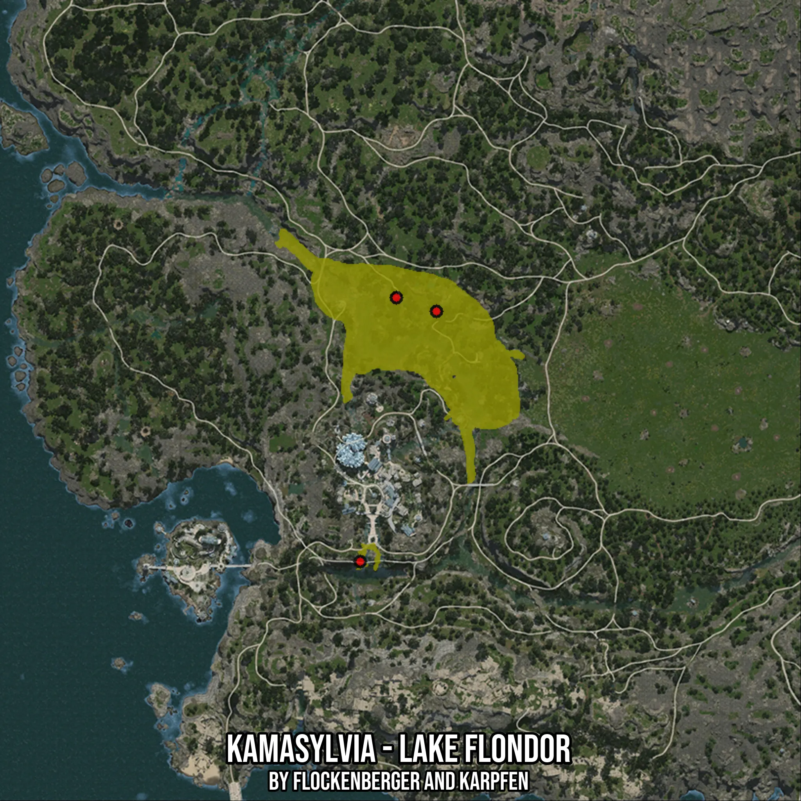

# Kamasylvia - Lake Flondor
Created by **flockenberger**

- **Red Points**: Exact in-game waypoints.
- **Colored Areas**: Entire area where the fishing table is consistent.
## ⚠️ Info about your float:
To verify your fishing position without modifying your files, you can do so [here](https://flockenberger.github.io/bdo-fish-position/).
- Or watch the guide [here](https://youtu.be/t-VXcRoNojk)

## Waypoints
Below you'll find the Copy-Paste ready XML file for this Fishing-Zone.

```xml
	<!--
		Waypoints for: Kamasylvia - Lake Flondor
		Auto-Generated by: flockenberger
		Preview at: https://github.com/Flockenberger/bdo-fish-waypoints/tree/main/Bookmark/Kamasylvia%20-%20Lake%20Flondor
	-->
	<WorldmapBookMark>
		<BookMark BookMarkName="1: Kamasylvia - Lake Flondor" PosX="-498145.8520412445" PosY="0.0" PosZ="-397854.16548252106" />
		<BookMark BookMarkName="2: Kamasylvia - Lake Flondor" PosX="-509289.38167095184" PosY="0.0" PosZ="-479171.81413173676" />
		<BookMark BookMarkName="3: Kamasylvia - Lake Flondor" PosX="-509289.38167095184" PosY="0.0" PosZ="-479171.81413173676" />
		<BookMark BookMarkName="4: Kamasylvia - Lake Flondor" PosX="-509289.38167095184" PosY="0.0" PosZ="-479171.81413173676" />
		<BookMark BookMarkName="5: Kamasylvia - Lake Flondor" PosX="-485797.61650562286" PosY="0.0" PosZ="-402070.63615322113" />
	</WorldmapBookMark>
```

## Usage Guide
[](https://youtu.be/W-bWmKdv8K8)

## Previews
     

 