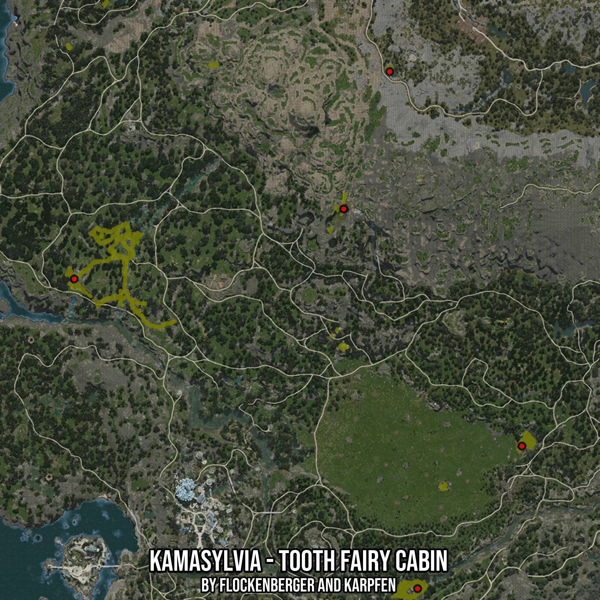

# Kamasylvia - Tooth Fairy Cabin
Created by **flockenberger**

- **Red Points**: Exact in-game waypoints.
- **Colored Areas**: Entire area where the fishing table is consistent.
## ⚠️ Info about your float:
To verify your fishing position without modifying your files, you can do so [here](https://flockenberger.github.io/bdo-fish-position/).
- Or watch the guide [here](https://youtu.be/t-VXcRoNojk)

## Waypoints
Below you'll find the Copy-Paste ready XML file for this Fishing-Zone.

```xml
	<!--
		Waypoints for: Kamasylvia - Tooth Fairy Cabin
		Auto-Generated by: flockenberger
		Preview at: https://github.com/Flockenberger/bdo-fish-waypoints/tree/main/Bookmark/Kamasylvia%20-%20Tooth%20Fairy%20Cabin
	-->
	<WorldmapBookMark>
		<BookMark BookMarkName="1: Kamasylvia - Tooth Fairy Cabin" PosX="-563802.3239135742" PosY="0.0" PosZ="-346955.3409576416" />
		<BookMark BookMarkName="2: Kamasylvia - Tooth Fairy Cabin" PosX="-404178.7913799286" PosY="0.0" PosZ="-490917.69671440125" />
		<BookMark BookMarkName="3: Kamasylvia - Tooth Fairy Cabin" PosX="-355689.37866687775" PosY="0.0" PosZ="-424658.8718891144" />
		<BookMark BookMarkName="4: Kamasylvia - Tooth Fairy Cabin" PosX="-438512.9096984863" PosY="0.0" PosZ="-314428.2814979553" />
		<BookMark BookMarkName="5: Kamasylvia - Tooth Fairy Cabin" PosX="-417129.3798685074" PosY="0.0" PosZ="-250578.86848449707" />
	</WorldmapBookMark>
```

## Usage Guide
[](https://youtu.be/W-bWmKdv8K8)

## Previews
     

 